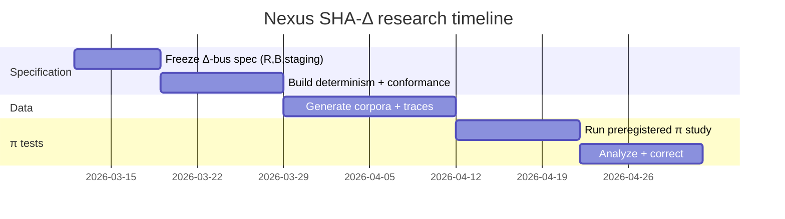

# Nexus SHA-Δ Project: Δ-bus Carry Signatures, BBP π Addressing, and a Reproducible Research Program

## Executive summary

**Connector order (explicit):** **github**, **google_drive**, then **web**.

**Download:** [Nexus_SHA_Delta_Deep_Research_Report.md](sandbox:/mnt/data/Nexus_SHA_Delta_Deep_Research_Report.md)

This report treats the Nexus SHA-Δ project as a rigorous research program: instrument SHA-256 to capture **carry/overflow residue** (Δ-bus), generate structured inputs via **BBP-addressable π digit streams**, and test whether residue-derived “packet families” show statistically meaningful structure beyond chance. The deliverable is not metaphysical proof; it is **a falsifiable specification**, **implementable code**, and **replication-grade experimental design**.

Key internal artifacts were identified via the requested connectors. On **GitHub (QuHarmonics/AI_Repository)**, searching for “Δ-bus” and “delta-bus” returned no filename hits, but the repo contains multiple SHA-256 “unfolding” and Nexus thesis documents, including an “Unfolding SHA-256” themed note set. fileciteturn77file2 On **Google Drive**, “Delta-bus” search returned “Recursive Knowledge Synthesis Through Gaps” (project manuscript) and multiple Nexus/SSSE implementation blueprints and working spreadsheets. fileciteturn81file0turn83file0turn85file0

External primary sources used include the NIST publication page for **FIPS 180-4** (SHA-256 formal definition), which anchors all algorithmic equations. citeturn0search1 BBP digit extraction is grounded in David H. Bailey’s technical report describing the BBP formula and its arbitrary-position hexadecimal digit property. citeturn0search0 Large-π digit search and retrieval capabilities are supported by PiSearch (up to 2×10^9 decimal digits) and pi.delivery (API including radix=16). citeturn2search0turn2search6

**Conjecture vs established facts:** SHA-256 equations, constants, and padding are established by FIPS 180-4. citeturn0search1 Carry generate/propagate identities are established digital logic results. citeturn1search24turn1search29 BBP’s base-16 “digit extraction” property is established. citeturn0search0 The claims that Δ-bus signatures constitute a conserved “scar channel,” that certain derived packets map unusually into π, or that “rasterized rendering” governs physical reality are treated as **hypotheses** to explore with controlled experiments rather than as conclusions.

## Evidence and artifacts from connectors

### GitHub: QuHarmonics/AI_Repository

Search terms: “Δ-bus”, “delta-bus”, “Nexus”, “W[63]”, “carry mask”, “SHA-256”, “message schedule”, “W[t]”.

- “Δ-bus” / “delta-bus” produced no filename hits in the repo (does not disprove presence in file bodies).
- Multiple SHA-256-focused thesis documents appear under Nexus thesis folders, including “Unfolding Sha-256 Via Recursive Harmonics” and related items. fileciteturn77file2turn77file0
- “W[63]” appears in indexed chat artifacts, consistent with prior focus on $W[63]$ as a “thin-air” reverse bottleneck. fileciteturn75file0
- Multiple “Nexus Framework / Codex” items appear in the repo’s thesis sections. fileciteturn74file0turn74file2

### Google Drive

Queries: “Delta-bus”, “Nexus”, “SSSE”, “pi”, “xlsx”, “png”.

- “Recursive Knowledge Synthesis Through Gaps” appears under “Delta-bus” query and is treated as the canonical internal Δ-bus manifesto/spec seed. fileciteturn81file0
- SSSE v2.0 implementation/pilot items appear, providing a structured build + pilot test framing. fileciteturn83file0turn83file4
- Working spreadsheets and project indexes appear (Start research.xlsx etc.). fileciteturn85file0turn85file6

### Uploaded local manuscripts

These files inform the project’s modeling language (treated as hypotheses/lenses):

- Waveform framing of arithmetic/operations (“Waveform Nature…”). fileciteturn72file0
- “Hexadecimal Wave Computation…” proposes Nyquist/quantization framing for discrete crypto operations (hypothesis). fileciteturn72file2
- “Dual-Wave Computation…” provides a two-channel projection formalism. fileciteturn72file3
- “Hydrodynamic Singularities…” proposes an attractor $H=\pi/9\approx0.349066$ in a harmonic architecture (hypothesis). fileciteturn72file1

### Required artifacts and extraction steps

To make the program reproducible, the following artifacts must be versioned:

- **Δ-bus spec file:** fixed $\mathcal{R}$ (rounds), $\mathcal{B}$ (hinge bits), add-chain ordering, and serialization definition.
- **Frozen π corpus:** define and checksum the exact π digit source (decimal and/or hex). For API sources, record URL, parameters, and retrieved content checksums. citeturn2search6
- **Reference SHA vectors:** conformance tests against FIPS-known test vectors to ensure correct SHA core before measuring Δ. citeturn0search1
- **Result logs:** per-message JSONL/Parquet with message bytes, digest, selected schedule words, Δ signature, and π-hit outcomes.

## Research questions

- **RQ1 (spec):** What is the minimal fully reproducible Δ-bus definition (exact rounds, hinge bits, and addition chains) that yields a fixed-length signature (e.g., 176 bits) and is cross-language consistent?
- **RQ2 (utility):** Does Δ-bus add information beyond digest bits and trivial features (Hamming weights, XOR/AND statistics)?
- **RQ3 (π baseline):** Under a null model, what are the expected hit rates and first-occurrence distributions for packet encodings in π, and do any derived packets deviate after correcting for selection and multiple testing? citeturn2search0
- **RQ4 (mapping):** Is there a deterministic mapping from carry topology (wrap counts, hinge signatures) to π indices that performs above chance?
- **RQ5 (BBP vs decimal):** How do results differ when you treat π as a hex-digit stream (BBP-friendly) versus a decimal-digit stream? citeturn0search0turn2search6

## Mathematical foundation

### SHA-256 per FIPS 180-4

citeturn0search1

**Message schedule.** Parse a 512-bit block into 16 big-endian words $W_0,\dots,W_{15}$. For $t=16,\dots,63$:

$$
W_t = \left(W_{t-16} + \sigma_0(W_{t-15}) + W_{t-7} + \sigma_1(W_{t-2})\right)\bmod 2^{32}.
$$

$$
\sigma_0(x)=\mathrm{ROTR}^7(x)\oplus \mathrm{ROTR}^{18}(x)\oplus (x\gg 3),\qquad
\sigma_1(x)=\mathrm{ROTR}^{17}(x)\oplus \mathrm{ROTR}^{19}(x)\oplus (x\gg 10).
$$

**Round functions.**

$$
\mathrm{Ch}(x,y,z)=(x\wedge y)\oplus(\neg x\wedge z),\qquad
\mathrm{Maj}(x,y,z)=(x\wedge y)\oplus(x\wedge z)\oplus(y\wedge z).
$$

$$
\Sigma_0(x)=\mathrm{ROTR}^2(x)\oplus \mathrm{ROTR}^{13}(x)\oplus \mathrm{ROTR}^{22}(x),\qquad
\Sigma_1(x)=\mathrm{ROTR}^6(x)\oplus \mathrm{ROTR}^{11}(x)\oplus \mathrm{ROTR}^{25}(x).
$$

**Round update.**

$$
T_1 = h + \Sigma_1(e) + \mathrm{Ch}(e,f,g) + K_t + W_t \pmod{2^{32}},\qquad
T_2 = \Sigma_0(a)+\mathrm{Maj}(a,b,c)\pmod{2^{32}}.
$$

$$
h=g,\ g=f,\ f=e,\ e=d+T_1,\ d=c,\ c=b,\ b=a,\ a=T_1+T_2 \pmod{2^{32}}.
$$

### Wrap decomposition

$$
S=x+y,\qquad S=q\cdot 2^{32}+r,\qquad q=\left\lfloor \frac{S}{2^{32}}\right\rfloor,\qquad r=S\bmod 2^{32}.
$$

For staged multi-term additions (e.g., $T_1$ assembled via four sequential 32-bit additions), record both:

- **Per-step wrap bits** $q_1,q_2,q_3,q_4\in\{0,1\}$ from each 32-bit addition in the staged chain.
- **Aggregate wrap count** for the full unbounded sum $S_{\mathrm{full}}=h+\Sigma_1(e)+\mathrm{Ch}(e,f,g)+K_t+W_t$ computed in a wider integer type:

$$
q_{\mathrm{full}}=\left\lfloor\frac{S_{\mathrm{full}}}{2^{32}}\right\rfloor,\qquad r_{\mathrm{full}}=S_{\mathrm{full}}\bmod 2^{32}.
$$

In Python, $q_{\mathrm{full}}$ is exact because integers are arbitrary precision. In C/Rust, compute in 64-bit (or wider) and include the exact staging order in the Δ-bus spec to preserve determinism.

### Carry generate/propagate identities

$$
G_i=A_iB_i,\qquad P_i=A_i\oplus B_i,\qquad C_{i+1}=G_i+P_iC_i.
$$

citeturn1search24turn1search29

### Carry mask

Let $c_0=0$ and for bits $i=0..31$:

$$
g_i = x_i\wedge y_i,\qquad p_i=x_i\oplus y_i,\qquad c_{i+1} = g_i \vee (p_i\wedge c_i).
$$

$$
\mathrm{carrymask}(x,y) = \sum_{i=0}^{31} c_{i+1}2^i.
$$

### Δ-bus signature construction

Staged $T_1$ chain:

$$
u_1=h+\Sigma_1(e),\quad u_2=u_1+\mathrm{Ch}(e,f,g),\quad u_3=u_2+K_t,\quad T_1=u_3+W_t \pmod{2^{32}}.
$$

Sample carry masks $c_{t,1..4}$ and hinge bits $b\in\mathcal{B}$ for rounds $t\in\mathcal{R}$:

$$
\Delta_{t,j,b} = \left(\frac{c_{t,j}}{2^b}\right)\bmod 2.
$$

Fixed-length example:

$$
|\Delta| = |\mathcal{R}|\cdot 4\cdot |\mathcal{B}| = 176.
$$

**Example candidate configuration (to be frozen in a spec):**

- Hinge bits (example): $\mathcal{B}=(0,5,17,31)$.
- H-LOCK rounds (example): $\mathcal{R}=(0,7,14,21,28,35,42,49,56,61,63)$.

These satisfy the 176-bit constraint when sampling 4 carry masks per sampled round. They are not claimed to be uniquely correct; the point is to make the experimentation concrete and reproducible.

### BBP for π digit extraction

$$
\pi = \sum_{k=0}^{\infty}\frac{1}{16^k}\left(\frac{4}{8k+1}-\frac{2}{8k+4}-\frac{1}{8k+5}-\frac{1}{8k+6}\right).
$$

citeturn0search0

## Implementable computation

Safe instrumentation only (no cryptographic break guidance).

```python
from __future__ import annotations
from dataclasses import dataclass
from typing import Iterable, List, Tuple
import struct
import numpy as np

MASK32 = 0xFFFFFFFF

def rotr(x: int, n: int) -> int:
    x &= MASK32
    return ((x >> n) | (x << (32 - n))) & MASK32

def sigma0(x: int) -> int:
    return rotr(x, 7) ^ rotr(x, 18) ^ ((x & MASK32) >> 3)

def sigma1(x: int) -> int:
    return rotr(x, 17) ^ rotr(x, 19) ^ ((x & MASK32) >> 10)

def Sigma0(x: int) -> int:
    return rotr(x, 2) ^ rotr(x, 13) ^ rotr(x, 22)

def Sigma1(x: int) -> int:
    return rotr(x, 6) ^ rotr(x, 11) ^ rotr(x, 25)

def Ch(x: int, y: int, z: int) -> int:
    return (x & y) ^ ((~x) & z)

def Maj(x: int, y: int, z: int) -> int:
    return (x & y) ^ (x & z) ^ (y & z)

def sha256_pad_1block(msg: bytes) -> bytes:
    ml = len(msg) * 8
    out = bytearray(msg)
    out.append(0x80)
    while ((len(out) * 8) % 512) != 448:
        out.append(0)
    out += struct.pack(">Q", ml)
    if len(out) != 64:
        raise ValueError("Message does not fit in one block after padding.")
    return bytes(out)

def parse16(block64: bytes) -> List[int]:
    return list(struct.unpack(">16I", block64))

def expand_schedule(block64: bytes) -> List[int]:
    W = [0]*64
    W[:16] = parse16(block64)
    for t in range(16,64):
        W[t] = (W[t-16] + sigma0(W[t-15]) + W[t-7] + sigma1(W[t-2])) & MASK32
    return W

def carrymask_gp(x: int, y: int) -> int:
    x &= MASK32; y &= MASK32
    c = 0; mask = 0
    for i in range(32):
        xi = (x >> i) & 1
        yi = (y >> i) & 1
        g  = xi & yi
        p  = xi ^ yi
        c_next = g | (p & c)
        if c_next:
            mask |= (1 << i)
        c = c_next
    return mask & MASK32

@dataclass(frozen=True)
class DeltaBusConfig:
    rounds: Tuple[int, ...]
    hinge_bits: Tuple[int, ...]

def sample_bits(mask: int, hinge_bits: Tuple[int, ...]) -> int:
    out = 0
    for k,b in enumerate(hinge_bits):
        out |= ((mask >> b) & 1) << k
    return out

def delta_signature_block(block64: bytes, H: Tuple[int,...], K: Tuple[int,...], cfg: DeltaBusConfig) -> List[int]:
    W = expand_schedule(block64)
    a,b,c,d,e,f,g,h = H
    sig: List[int] = []
    for t in range(64):
        x1 = (h + Sigma1(e)) & MASK32; cm1 = carrymask_gp(h, Sigma1(e))
        x2 = (x1 + Ch(e,f,g)) & MASK32; cm2 = carrymask_gp(x1, Ch(e,f,g))
        x3 = (x2 + K[t]) & MASK32;     cm3 = carrymask_gp(x2, K[t])
        T1 = (x3 + W[t]) & MASK32;     cm4 = carrymask_gp(x3, W[t])
        T2 = (Sigma0(a) + Maj(a,b,c)) & MASK32
        if t in cfg.rounds:
            sig.extend([sample_bits(cm1,cfg.hinge_bits), sample_bits(cm2,cfg.hinge_bits),
                        sample_bits(cm3,cfg.hinge_bits), sample_bits(cm4,cfg.hinge_bits)])
        h=g; g=f; f=e; e=(d+T1) & MASK32
        d=c; c=b; b=a; a=(T1+T2) & MASK32
    return sig

def batch_delta_signatures(msgs: Iterable[bytes], H, K, cfg: DeltaBusConfig) -> List[List[int]]:
    outs=[]
    for m in msgs:
        outs.append(delta_signature_block(sha256_pad_1block(m), H, K, cfg))
    return outs

# Vectorized schedule expansion for many messages (W0_15 shape (B,16) uint32)
def rotr_u32(x: np.ndarray, n: int) -> np.ndarray:
    return ((x >> np.uint32(n)) | (x << np.uint32(32-n))).astype(np.uint32)

def sigma0_u32(x: np.ndarray) -> np.ndarray:
    return rotr_u32(x,7) ^ rotr_u32(x,18) ^ (x >> np.uint32(3))

def sigma1_u32(x: np.ndarray) -> np.ndarray:
    return rotr_u32(x,17) ^ rotr_u32(x,19) ^ (x >> np.uint32(10))

def expand_schedule_batch(W0_15: np.ndarray) -> np.ndarray:
    B = W0_15.shape[0]
    W = np.zeros((B,64), dtype=np.uint32)
    W[:, :16] = W0_15
    for t in range(16,64):
        W[:,t] = (W[:,t-16] + sigma0_u32(W[:,t-15]) + W[:,t-7] + sigma1_u32(W[:,t-2])).astype(np.uint32)
    return W
```

Complexity: $O(64N)$ schedule steps; carrymask adds $O(32)$ per traced addition; to scale, compile carry loops (Numba/C) and stream signatures.

## Statistical test plan

### Encoding table for π searches

| Packet | Decimal | Hex | Bytes | Which π corpus? |
|---|---|---|---|---|
| $W[63]$ | base-10 string | 8-hex chars | 4 bytes | decimal π for decimal; hex π for hex |
| carrymask | base-10 | 8-hex | 4 bytes | hex π recommended |
| Δ signature | base-10/hex encoding | hex/base32 | n/a | not meaningful unless mapping defined |

### Null model, p-values, multiple testing

**Random controls:** For each derived string family, generate matched random controls before searching π.

- **Length-matched controls:** sample random decimal strings of the same length $m$.
- **Charset/base-matched controls:** if searching hex π digits, sample random hex strings of the same length.
- **Distribution-matched controls:** optionally sample from the empirical distribution of derived packets (e.g., $W[63]$ values over many random messages) to match low-order statistics while preserving length and base.

Record the full tested set (derived + controls) to avoid selection bias.

Assume iid uniform digits (null). For $m$-digit string in length $N$ corpus:

$$
\lambda\approx \frac{N}{10^m},\qquad X\sim \mathrm{Poisson}(\lambda),\qquad p=\Pr[X\ge x].
$$

Bonferroni: $\alpha'=\alpha/M$; BH-FDR: largest $k$ with $p_{(k)}\le (k/M)q$.

**Sample size guidance (practical):**

- If you plan to compare *hit rates* for a packet family vs. random controls, plan for at least $n\ge 10^4$ strings per condition for stable rate estimates at 8–10 digits.
- If you plan to test *first-occurrence positions* (geometric waiting times), you need enough independent strings that the empirical distribution of first-hit positions can be compared (e.g., KS test) without being dominated by a few extreme early hits.

**How to compute p-values in practice (Python skeleton):**

```python
import math

def poisson_sf(k, lam):
    # survival function P(X >= k) for Poisson(lam)
    # naive sum for small k; for large experiments use scipy.stats.poisson.sf
    s = 0.0
    for i in range(k):
        s += math.exp(-lam) * (lam**i) / math.factorial(i)
    return 1.0 - s

# Example: N=200_000_000 digits, m=9 => lam ~ 0.2
N = 200_000_000
m = 9
lam = N / (10**m)
obs = 1
p = poisson_sf(obs, lam)
print(lam, p)
```

### Expected vs observed chart

```mermaid
xychart-beta
  title "π Hits: Expected vs Observed (template)"
  x-axis ["8 digits","9 digits","10 digits"]
  y-axis "hits per 200M digits" 0 --> 3
  bar "Expected (null)" [2.0, 0.2, 0.02]
  bar "Observed" [?, ?, ?]
```

## Reproducible experiment plan

1. Conformance vs FIPS vectors. citeturn0search1
2. Freeze Δ-bus spec (rounds/hinge bits/staging); record config hash.
3. Generate corpora: random, structured, one-bit flips.
4. Compute {digest, W63, carry stats, Δ signature}.
5. π tests: preregister string families; run searches via PiSearch and pi.delivery as appropriate. citeturn2search0turn2search6
6. Statistics: p-values + correction; report effect sizes.
7. Replicate on new machine/implementation.



Failure modes: endianness, staging drift, π indexing mismatch, selection bias.

## Risk, ethics, and references

This is instrumentation research; avoid deploying trace capture on secrets or production systems. SHA-256 is standardized for cryptographic use in FIPS 180-4. citeturn0search1

References: NIST FIPS 180-4 citeturn0search1turn0search2; BBP algorithm report citeturn0search0; carry CLA identities citeturn1search24turn1search29; π tools PiSearch & pi.delivery citeturn2search0turn2search6; internal GitHub/Drive artifacts fileciteturn77file2turn81file0turn83file0turn85file0; uploaded modeling docs fileciteturn72file0turn72file3turn72file2.