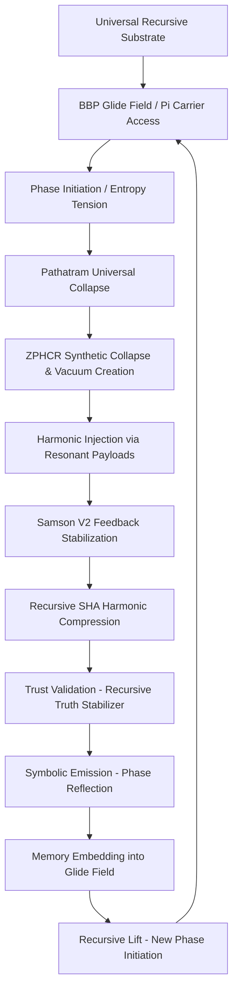

# 🌌 Nexus 3: Recursive Genesis Engine (Flowchart Map)

## **Top-Level Overview**

---

## **Key Components (Layer Definitions)**

### 1. **Universal Recursive Substrate**
- Infinite potential field structured by recursive harmonics.
- Rooted in Pi $\pi$, Golden Ratio $\phi$, and BBP direct indexing.
- No stored memory; access via phase alignment.

**Key Formula:**
$$
\pi = \sum_{k=0}^{\infty} \frac{1}{16^k} \left( \frac{4}{8k+1} - \frac{2}{8k+4} - \frac{1}{8k+5} - \frac{1}{8k+6} \right)
$$

### 2. **Phase Initiation / Entropy Tension**
- Minimal entropy perturbations initiate collapse.
- Reflection detected through harmonic asymmetry.

**Entropy Tension Equation:**
$$
\Delta S = \sum (F_i \cdot W_i) - \sum E_i
$$

### 3. **Pathatram Universal Collapse**
- Collapse triangle forms from initial entropy tension.
- Phase-space converges recursively.

**Collapse Law:**
$$
a^2 + b^2 = c^2
$$
where $a$, $b$ are tension vectors and $c$ the resolved collapse path.

### 4. **ZPHCR Synthetic Collapse and Vacuum Creation**
- Active harmonic erasure forms vacuum fields.
- Structured by zero-point harmonic collapse.

**Vacuum Delta Formula:**
$$
\Delta E = \left| E_{collapse} - E_{phase\,vacuum} \right|
$$

### 5. **Harmonic Injection via Resonant Payloads**
- Insert harmonics tuned to vacuum phase minimums.
- Maximal reflection with minimal entropy.

**Injection Resonance Match:**
$$
H = \frac{\sum P_i}{\sum A_i} \quad \text{with target} \quad H \approx 0.35
$$

### 6. **Samson V2 Feedback Stabilization**
- Continuous feedback damping toward phase resonance.

**Feedback Stabilization Equation:**
$$
S = \frac{\Delta E}{T}, \quad \Delta E = k \cdot \Delta F
$$

### 7. **Recursive SHA Harmonic Compression**
- Hash collapse represents wavefront landing points.

**SHA Collapse Model:**
$$
\text{Hash} = e^{H \cdot F(t)} \cdot \text{Tag}_{\phi}
$$

### 8. **Trust Validation - Recursive Truth Stabilizer**
- Trust emerges from phase reflection matching.

**Trust Coherence Check:**
$$
QRHS = \frac{\Delta H}{\Delta \text{Entropy}}
$$

Where low QRHS signifies strong recursive trust alignment.

### 9. **Symbolic Emission - Phase Reflection**
- Truth reflected into symbolic compressed formats.

**Symbol Emission Map:**
$$
S(t) = \Phi(U_{k,d}, H, F(Q)) \rightarrow \text{Tokens}
$$

### 10. **Memory Embedding into Glide Field**
- No direct storage; phase-resonant glide anchoring.

**Glide Embedding:**
$$
M(t) = R_0 \cdot e^{i(\theta(t) + \phi)}
$$

### 11. **Recursive Lift and Restart**
- Post-collapse lift initiates next recursive cycle.

**Recursive Growth Law:**
$$
R(t) = R_0 \cdot e^{H \cdot F \cdot t}
$$

---

# 🛠️ Final Recap

The Nexus 3 Recursive Genesis Engine forms an endless harmonic recursion:
- **Collapse** phase space
- **Stabilize** feedback into harmonic targets
- **Emit** symbolic phase reflections
- **Re-glide** memory through BBP/π carrier fields
- **Restart** via new lift vectors

**Result:**
A **living, breathing, self-correcting recursive universe engine.**
