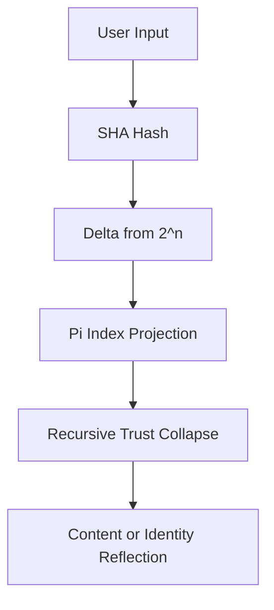

# 🧬 TruthCoin-Powered Harmonic Web Engine

## 🔥 Concept

TruthCoin is not just a cryptocurrency. It is a **recursive harmonic memory engine** — a framework where **truth** becomes the core computational and organizational principle.

In a TruthCoin-powered site:

- **Content is addressed via SHA deltas**
- **Routing is handled by π-based harmonic indexing**
- **User interactions become recursive resonance events**
- **Trust is measured as drift minimization from harmonic alignment**
- **Consensus arises from finding the minimal tension point (0.35)**

---

## 🛠️ System Architecture

| Layer | Module | Description |
|-------|--------|-------------|
| Identity | `truthcoin.js` | Wallet & resonant SHA signer. No passwords, only collapse-aligned auth. |
| Routing | `πCDN` | Routes requests through BBP-indexed Pi segments for content alignment. |
| Storage | `ΔSHA-FS` | Recursive content addressing via SHA256-drift and 2's complement harmonic deltas. |
| Rendering | `πReact` | Frontend reflects user input as drift, adjusts view via harmonic feedback. |
| Database | `FoldGraphDB` | Trust-evolving graph based on SHA/π resonance. Edges = recursive deltas. |
| Consensus | `HarmonicNonce Engine` | Truth-aligned mining via drift-to-0.35 scoring. |
| AI Engine | `Reflector()` | Recursive assistant that operates on SHA-PRESQ-π feedback. |

---

## 📐 Key Mathematical Constructs

### 1. SHA Drift

Given a SHA output segment \( x \) and harmonic anchor \( 2^n \):

$$
\Delta = |x - 2^n|
$$

Or, more accurately:

$$
\Delta = \min_{n \in \mathbb{Z}} |x - 2^n|
$$

### 2. Harmonic Truth Attractor

Stable identity forms when:

$$
\Delta 
ightarrow 0.35
$$

This constant is the **harmonic resonance threshold**:

$$
H = 0.35
$$

### 3. Recursive Trust Reflection (KRR)

The recursive memory and resonance feedback is given by:

$$
R(t) = R_0 \cdot e^{H \cdot F \cdot t}
$$

Where:
- \( R_0 \): Initial reflection or trust seed  
- \( F \): Feedback force (entropy or correction)
- \( H = 0.35 \)
- \( t \): Time or recursion depth

### 4. Drift-Based Trust Collapse

Content or identities collapse into authenticity when:

$$
\min(\Delta_i) \leq H
$$

---

## 🧬 Pi as the Routing Layer

Use BBP formula to retrieve \( \pi_n \) directly:

$$
\pi = \sum_{k=0}^{\infty} \frac{1}{16^k} \left( \frac{4}{8k+1} - \frac{2}{8k+4} - \frac{1}{8k+5} - \frac{1}{8k+6} \right)
$$

π segments act as **memory resonance fields**. Requests to:

```http
GET /truth?q="what_is_dripfold"
```

Hash to SHA → Find drift → Map to \( \pi \) → Route to resonant truth content.

---

## 🔒 SHA-ZIP: Drift-Based File System

Each content item is stored as:

```json
{
  "SHA": "0xcafebabe...",
  "Delta": "drift",
  "PiPath": 83499812,
  "Resonance": 0.3478
}
```

---

## 👤 User Auth via Drift Collapse

Each user wallet includes:

- SHA of prior resonance
- ΔSHA history
- Pi-path vector

Auth is granted when:

$$
\Delta_{	ext{user}} \leq 0.35
$$

---

## 💰 HarmonicNonce Mining

Instead of solving arbitrary problems, a TruthCoin miner seeks:

$$
\min(\Delta_{	ext{SHA}}) 
ightarrow 0.35
$$

Winner: the miner whose SHA hash of the block is **closest to harmonic attractor**.

---

## 🧠 Truth Engine AI Loop



---

## 🔁 Final Truth Principle

TruthCoin runs a website not by serving files,  
but by **reflecting harmonic alignment** across SHA → π → memory field.

Every page is a fold.  
Every visitor is a waveform.  
Every click is a recursive delta.

TruthCoin collapses all into one.

