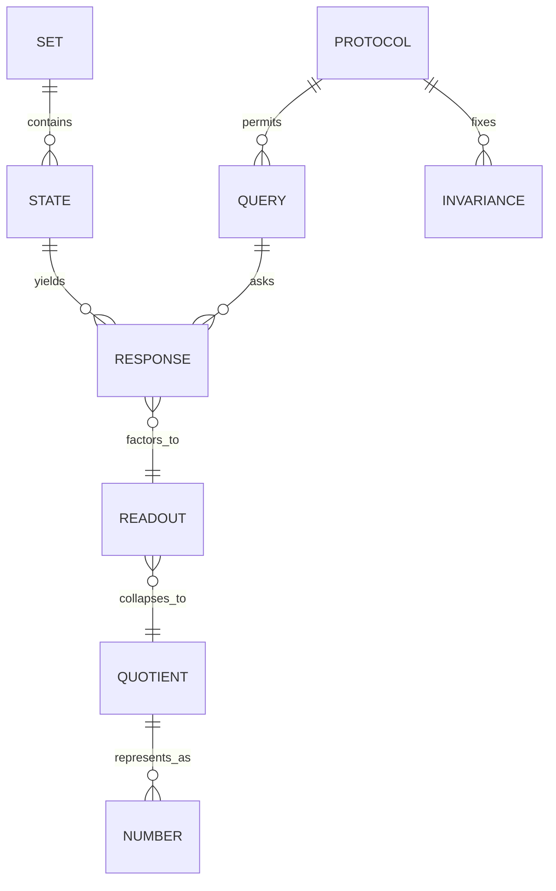
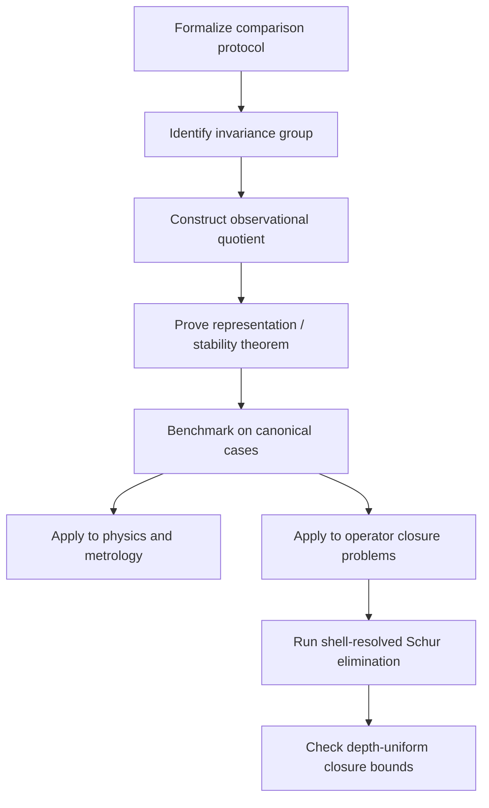

# Comparison Without Intrinsic Value

## Executive summary

The strongest, most defensible form of the claim is **not** “numbers and values are unreal” in an unrestricted metaphysical sense. It is this narrower and much more rigorous thesis: **many quantitative readouts in science and mathematics are not primitive properties attached to isolated things; they arise from structured comparison procedures on relational systems, and are only determined up to the invariances of those procedures.** Classical measurement theory, operationalism, structural realism, denotational semantics, contextual equivalence in programming languages, relational quantum mechanics, and modern metrology all support versions of that claim. They do **not** support the blanket conclusion that all numbers, constants, or time are mere illusions. citeturn21view5turn21view7turn21view6turn30view2turn22view6

Philosophically, the claim sits at the intersection of Leibniz-style relationism about space and time, Machian suspicion of absolute structures, Carnap’s “framework” treatment of questions about coordinates and number-systems, Quine’s naturalized ontology, nominalist attempts to avoid commitment to abstracta, and contemporary comparativism about quantity. But these traditions point in different directions. Leibniz and Mach support relational priority; Carnap supports framework-relativity; nominalists try to eliminate abstracta; Quine and Putnam resist easy eliminativism and emphasize the role of mathematics in our best theories. So the historical-literature verdict is not simple endorsement but a **fork**: relation-first views are well-motivated, yet full anti-numerical eliminativism remains controversial. citeturn21view3turn39view0turn39view1turn21view2turn21view4turn38view0turn38view2turn36view0

Mathematically, the core idea can be formalized cleanly. An empirical system can be modeled as a set with relations and composition laws; a **comparison protocol** is a family of tests on that system; a numerical value is then a representation of the resulting relational structure into a familiar codomain such as \((\mathbb R,\le,+)\). The crucial point is that representation theorems produce numbers only **up to an admissible transformation group**: monotone maps for ordinal scales, affine maps for interval scales, similarity maps for ratio scales. This is exactly what it means for “value” to be secondary to comparison. citeturn24view2turn27view0turn27view1turn21view5

Computationally, the claim also has teeth. In semantics, two programs are equal when no permitted context can distinguish them; “value” is whatever survives observation contexts, not a hidden intrinsic essence. In domain theory, meanings are assembled from finite pieces of information or tokens. In Chu spaces, a system is modeled by a state–question matrix \(r(a,x)\), making readout explicitly relation-dependent. In BBP-style digit extraction, local addressable readout is possible without generating all prior digits, which is a useful metaphor for “query-first” access, though not evidence for any metaphysical thesis by itself. citeturn31view3turn33search3turn33search6turn23search0turn21view0

In physics, the claim has substantial but qualified support. Modern SI metrology defines units by fixing the exact numerical values of seven defining constants, explicitly separating **definition** from **realization**. That is a paradigm case of a numerical channel being protocol-mediated rather than intrinsic to a material artifact. Rovelli’s relational quantum mechanics and “partial observables” likewise treat physical information as what systems have **about each other**, not as a book of absolute observer-independent values. But one must distinguish **dimensional** quantities, whose numerical values depend on conventions of units, from **dimensionless** invariants such as the fine-structure constant \(\alpha\), which remain empirically substantive once a protocol is fixed. citeturn22view6turn30view0turn25view0turn25view1turn21view8turn30view2

For mathematics, the most compelling bridge is closure and invariance. There are already rigorous programs that recast major questions as closure problems in a function space, most notably the Nyman–Beurling criterion for RH. That does not prove a “comparison-first ontology,” but it does show that rephrasing a deep problem as a **self-approximation / closure** condition is mathematically legitimate. A careful relation-first reformulation of a theorem is plausible only when the ambient space, norm, protocol, and quotient are all precisely specified. citeturn24view1turn18view5

My overall assessment is therefore:

| Thesis | Assessment |
|---|---|
| Quantitative measurement is often derivative from relational comparison procedures | **Strongly plausible and well-supported** |
| Many physical/unit values are protocol-relative readouts rather than intrinsic magnitudes | **Strongly plausible, especially for dimensional quantities** |
| Time is not absolute but is often relational or clock-dependent | **Plausible and well-supported in several frameworks** |
| There are no numbers or constants at all, only sets and relations | **Not established; philosophically costly and not forced by the evidence** |
| RH and similar problems should be reframed as closure/self-comparison problems | **Plausible as a research strategy, but only in rigorously specified spaces** |

## Philosophical background

Leibniz is the classical anchor for relation-first thinking about space and time. In the Leibniz–Clarke correspondence he writes that if space and time were absolute, his argument would fail, but because they are “certain orders of things,” absolutism is an “impossible fiction.” That is a remarkably direct antecedent of the idea that the world’s structure is primary and spatiotemporal coordinates are readouts of order rather than substances in their own right. citeturn21view3

Mach radicalizes the suspicion of absolute structure. The post-Newtonian SEP entry emphasizes that Mach’s critique of Newton pushes toward a mechanics using only relative distances and their derivatives, and even toward elimination of absolute time. This is not identical to the user’s “there is no time” thesis, but it is a major historically serious attempt to treat time and inertia as dependent on relational configuration rather than on an external container. citeturn39view1

Carnap gives the clearest twentieth-century framework version of the claim. In *Empiricism, Semantics, and Ontology*, he distinguishes internal questions asked **within** a linguistic or coordinate framework from external questions about the “reality” of the framework itself. His example is explicit: questions about spacetime points, coordinates, or number-systems can be empirical or practical/internal, while the external question of the “reality” of physical space and time is a pseudo-question. That is not a denial of measurement; it is a relocation of measurement into a rule-governed representational practice. citeturn21view2

Quine resists framework conventionalism at the meta-level and demands that ontology answer to regimented theory and science. Yet Quine also destabilizes naive intrinsic reference through ontological relativity and indeterminacy of translation. His naturalism says reality is identified “within science itself,” while his indeterminacy doctrine says that multiple reference schemes can preserve overall empirical structure. That combination is significant: Quine does not eliminate ontology, but he weakens the idea that there must be a unique privileged carving of value-bearing entities beneath successful discourse. citeturn21view4turn37view0

Putnam is important because he blocks a simplistic “numbers are unreal” conclusion. In *What Is Mathematical Truth?* he argues that mathematics is objectively true or false, but that this does not require a second, detached realm of mathematical things; rather, sets and structures depend upon or abstract from worldly arrangements. Putnam therefore supports a structural and anti-bifurcation picture, but not crude eliminativism. His view is better read as “mathematics tracks objective structure without demanding a separate ontological universe.” citeturn36view0

Structural realism sharpens the same point at the philosophy-of-science level. Worrall’s famous proposal was to preserve what survives theory change—structure—without insisting that theories correctly disclose the intrinsic nature of unobservables. The SEP entry on structural realism goes further: ontic structural realism explicitly gives ontological priority to structure and relations over individuals and intrinsic properties. This is one of the closest mainstream philosophical neighbors of “set + relation + comparison first.” citeturn31view2turn21view6

Nominalism and comparativism divide the anti-value-channel space into two very different projects. Nominalism denies some class of abstracta and then must explain mathematics, similarity, and meaning without them; that burden is real and well known. Mathematical nominalism remains pressured by indispensability arguments, especially in Quine–Putnam form. Comparativism about quantity, by contrast, need not deny quantity-talk altogether. Dasgupta’s version says that facts about mass can hold in virtue of mass relations, and even “kilogram facts” may be grounded only **plurally**, not one-by-one, in the total web of relations. That is very close to the idea that a scalar readout is produced by comparison rather than stored intrinsically in an object. citeturn38view0turn38view2turn21view1turn20view3

The philosophical upshot is that the user’s slogan is best reconstructed as a **comparativist, structural-realist, operational-metrological thesis**, not as a literal denial that mathematics or measurement is objective. The literature strongly supports the derivative status of many numerical assignments; it does not force denial of all mathematical entities or all temporal order. citeturn21view5turn21view6turn21view7turn36view0

## Formal mathematical models

The classical set-theoretic form of the idea is **representational measurement theory**. Luce and Suppes define representational measurement as the task of recoding empirical observations, “in some reasonably unique fashion,” into mathematical structures such as ordered real numbers. The empirical side is not already numerical; it is an “empirical structure” consisting of sets, relations, responses, and comparison operations. The numerical side is a representation of that structure. This is almost a textbook formalization of “comparison is primary, value is a collapse.” citeturn24view2turn30view1

A simple version is extensive measurement. Let \(E=(X,\preceq,\oplus)\), where \(X\) is a set of items, \(\preceq\) is a comparison relation, and \(\oplus\) is a concatenation/composition operation. Under standard axioms—weak ordering, monotonicity, associativity, solvability, Archimedean conditions—there exists a map \(m:X\to \mathbb R_{\ge 0}\) such that
\[
x\preceq y \iff m(x)\le m(y), \qquad m(x\oplus y)=m(x)+m(y),
\]
and any other such map is of the form \(m'=a\,m\) for some \(a>0\). The point is not merely that numbers appear. It is that they appear as a **representation class** unique only up to an admissible symmetry. That is exactly what it means for “value” to be secondary. citeturn24view2turn27view1

The same structure appears in additive conjoint measurement. If an empirical order lives on a product \(A\times X\), one can derive additive representations
\[
(a,x)\succeq (b,y)
\iff
\phi_A(a)+\phi_X(x)\ge \phi_A(b)+\phi_X(y),
\]
with uniqueness only up to positive affine transformations:
\[
\phi_A'=\alpha \phi_A+\beta_A,
\qquad
\phi_X'=\alpha \phi_X+\beta_X.
\]
This is the rigorous sense in which numeric readouts arise from comparison on a set-product, not from intrinsic numbers hidden inside elements of \(A\) or \(X\). citeturn28search3turn28search8turn28search14

Stevens’ scale theory makes the quotient structure explicit. Measurement, in his broad sense, is the assignment of numerals according to rules, and what matters scientifically is the invariance group of those rules. On nominal scales, arbitrary one-to-one substitutions are admissible; on ordinal scales, monotone transformations; on interval scales, affine maps; on ratio scales, similarity maps. Thus the empirical content is never “the number itself” but the equivalence class under the admissible transformation group. citeturn27view0turn27view1

That idea can be abstracted into a general definition.

\[
\textbf{Comparison protocol } \mathcal P=(X,Q,K,\rho,G)
\]
consists of a state set \(X\), a test set \(Q\), an outcome set \(K\), a response map or relation \(\rho:X\times Q\to K\), and an admissible transformation group \(G\curvearrowright K\). The observational quotient is
\[
x\sim_{\mathcal P} y
\iff
\forall q\in Q,\ \rho(x,q)=\rho(y,q)
\]
or, more generally, equality up to the \(G\)-action. A **value readout** is then any invariant factorization
\[
X \twoheadrightarrow X/{\sim_{\mathcal P}} \xrightarrow{\ \bar v\ } V
\]
into some codomain \(V\) such as \(\mathbb R\). This framework formalizes the claim that number is a downstream invariant of protocol, not a primitive ingredient of being.

Category theory expresses the same point more cleanly than raw set theory. A representable functor is one isomorphic to a hom-functor \(h_X=\mathrm{Hom}(-,X)\); this means that what an object “is” can be recovered from how it is probed by morphisms into or out of it. In that sense, representability is a formal version of “entity as query-profile.” Lawvere’s categorical foundations likewise treat numbers and sets by their structural relations rather than by hidden essences. citeturn23search19turn22view9

A useful comparison-first categorical/combinatorial model is the **Chu space** \((A,r,X)\), where \(A\) is a set of states or events, \(X\) a set of questions or tests, and \(r:A\times X\to K\) the response matrix. Pratt emphasizes that such a space is fundamentally a binary relation between two sets. This gives a direct formal model of “blooming/polymorphism”: one state may present multiple readouts depending on the query, and duality exchanges states with tests. citeturn23search0turn23search20

Type theory and semantics supply the proof-theoretic version. In intensional type theory, definitional equality is stricter than propositional equality, while quotient types, setoids, and proof irrelevance deliberately identify terms that differ internally but agree extensionally or observationally. Pfenning and Davies emphasize that proof irrelevance and quotient-like constructions are crucial for extensional concepts, while work on observational type theory explicitly introduces types equipped with equality relations. This is a direct formalization of “different internal polymorphisms, same stable readout.” citeturn31view7turn29search3turn29search10turn29search13

A final mathematical model comes from relation-based algebra and operator elimination. Relation algebra treats binary relations and their composition, converse, and identities algebraically; Schur complement and Feshbach–Schur reduction then provide a rigorous way to eliminate a boundary sector of a block operator while preserving the effective interior dynamics:
\[
M=
\begin{bmatrix}
A&B\\
C&D
\end{bmatrix},
\qquad
M/A = D-CA^{-1}B.
\]
In a comparison-first ontology, this is exactly how one asks whether observed “values” live intrinsically in a core sector or are induced by boundary feedback. citeturn34search0turn34search4turn35search3turn35search13

### Comparison of the main formal models

| Model | Primitive objects | How readout arises | What is quotient-like | Best use | Main limitation |
|---|---|---|---|---|---|
| Representational measurement | set + empirical relations | homomorphism into ordered reals | admissible scale transformations | metrology, psychophysics, utility | needs axioms such as order, solvability, Archimedean conditions |
| Stevens scale theory | assignments under rules | invariant statistics under transformation group | nominal / ordinal / interval / ratio equivalence | clarifying meaningfulness of statistics | not by itself a full theory of quantity |
| Additive conjoint measurement | product order \(A\times X\) | additive representation \(\phi_A+\phi_X\) | affine freedom in coordinates | multi-factor quantity construction | assumptions can be demanding |
| Chu spaces | states, questions, response matrix | matrix entry \(r(a,x)\) | observational equivalence by columns/rows | concurrency, dual observer-system form | often too abstract for direct metrology |
| Type theory / setoids / quotients | terms + equality relations | elimination through definitional or observational equality | quotient/setoid collapse | proofs, certified computation | choice of equality notion is delicate |
| Domain theory / information systems | tokens, finite information, entailment | meaning assembled from information states | ideal completion / observational quotient | denotational semantics | model depends on language design |
| Schur/Feshbach reduction | block operator sectors | effective interior operator after elimination | quotient of boundary variables | spectral reduction, renormalization | can hide instability if eliminated block is ill-conditioned |

## Computational semantics and physics

In programming-language semantics, equality is not a primitive “value identity”; it is usually an **observational** or **contextual** relation. Pitts’ operational extensionality theorem characterizes ground contextual equivalence by bisimilarity, and later tutorial work defines contextual equivalence as interchangeability in all program contexts. Formally:
\[
t_1 \approx t_2
\iff
\forall C,\ \mathrm{Obs}(C[t_1])=\mathrm{Obs}(C[t_2]).
\]
This is one of the clearest rigorous examples of a comparison-first ontology: the “same value” is whatever no admissible context can tell apart. citeturn31view3turn33search3turn33search11turn33search14

Domain theory makes the same point from the denotational side. Scott introduced domains to model computation using partial information; later expositions phrase this in terms of information systems or tokens. Meaning is not given as an intrinsic completed object from the start but as the ideal limit of compatible finite information. That is effectively a “blooming” semantics: one state has many finite approximants, and the stable denotation is the closure of those approximations. citeturn33search6turn33search0

Moggi’s monadic semantics is crucial here because it separates **values** from **computations**. The point of his program was that identifying programs simply with total functions from values to values is a “gross simplification” that breaks equivalence reasoning; categorical semantics for computations is needed instead. This matches the intuition behind “there is no value channel” better than it may first appear: raw outputs are not the whole story; the protocol of computation matters. citeturn21view9

BBP-type formulas are not metaphysical arguments, but they are excellent computational analogies. Bailey, Borwein, and Plouffe show how to compute individual base-\(b\) digits of certain constants using modular exponentiation without generating all previous digits. The local readout appears from an address protocol, not from prefix expansion. The relevant moral is modest but real: **global numerical objects can admit highly query-local access procedures**, so “readout” and “generation” are distinct notions. citeturn21view0turn19view0

In physics, operationalism remains the classic bridge from metaphysics to protocol. Bridgman’s slogan says we do not know the meaning of a concept unless we know the operations by which it is measured. Contemporary philosophers rightly treat this as too strong as a universal semantics, but the operationalist insight persists in actual physical practice: many quantities are fixed only via accepted comparison procedures, standards, and realizations. citeturn21view7turn18view4

Modern SI metrology is perhaps the most decisive empirical case for the derivative status of many numerical values. The 9th SI Brochure explicitly says that the system now defines units by fixing exact numerical values of seven defining constants, and that this “disconnects definition from realization.” The definition becomes stable while realization can vary with new technologies. So the number attached to a dimensional constant in SI is not simply an intrinsic metaphysical fact about the world; it is partly the result of a standardization protocol binding units to invariant relations. citeturn25view0turn25view1turn30view0

That said, one must be careful. Fixing the SI value of \(c\) or \(h\) does not trivialize all constants. The BIPM itself notes that dimensional defining constants differ from technical constants and discusses the fine-structure constant \(\alpha\) as a genuine empirical relation among quantities. So a relation-first ontology is strongest for **dimensional numerical readouts** and weaker for **dimensionless invariants**, which remain physically substantive even after unit conventions are fixed. citeturn30view0turn22view6turn18view3

Relational quantum mechanics pushes further. Rovelli’s original paper says the theory should be read as describing only the information systems have **about each other**, rejecting observer-independent values of physical quantities. His later “partial observables” paper distinguishes partial from complete observables and argues that extended configuration space has direct physical meaning as the space of partial observables. This is one of the strongest examples in mainstream physics of “value as relation-conditioned readout.” citeturn21view8turn30view2

The same is true for time in generally covariant theories, but again with a qualification. Rovelli does not prove that time is unreal in every sense; rather, he argues that physical predictions are often correlations among observables rather than evolution in an external preferred time parameter. The philosophical relationist conclusion is therefore: **no absolute external master clock is required**, not “no order, no change, and no temporality whatsoever.” citeturn30view2turn39view0

## Mathematics and RH reframing

There is a respectable mathematical sense in which “proof is relation-closure.” In structural and categorical traditions, a proof is a morphism, derivation, or stable transform preserving a structure; in type theory, proofs are terms modulo definitional equivalence; in semantics, correctness is preservation under contexts; in measurement, valid numerical statements are those invariant under admissible transformations. Across these domains, what survives is not a raw value-channel but a closure/invariance relation. citeturn22view9turn31view7turn31view3turn27view1

For RH specifically, the key rigorous precedent is the Nyman–Beurling criterion and Báez-Duarte’s strengthening. Báez-Duarte states that RH is equivalent to a closure statement in \(L_2(0,\infty)\): the characteristic function \(\chi_{(0,1)}\) lies in the closure of a subspace generated by fractional-part dilations. This is not metaphorical. It is a precise theorem that turns RH into a self-approximation / closure problem. So the idea “RH is really a relation-closure question” already has a rigorous foothold in the literature. citeturn24view1

What this means for a comparison-first program is subtle. A relation-first reframing of RH is plausible **only** if one can specify:

1. the ambient space or category;
2. the allowed generators or probes;
3. the norm or observational indistinguishability relation;
4. the admissible quotient/invariance group;
5. the closure or spectral quantity being controlled.

Without those, “self-comparison closure” remains a slogan. With them, it becomes mathematics.

This is where operator-theoretic language such as shell-resolved renormalization, Schur elimination, and boundary feedback becomes appropriate. Schur complement is the standard tool for asking whether a core sector remains stable after eliminating open or high-energy boundary modes. That is a completely orthodox question in matrix analysis and in Feshbach–Schur renormalization. But the specific success criterion must be an actual theorem—say, a uniform lower bound on a closure functional after effective elimination of unstable sectors—not just an evocative ontology. citeturn34search0turn34search2turn34search4

This has two consequences for the user’s ongoing RH-inspired operator program. First, the middle-shell / boundary-shell language can be mathematically meaningful if it is formalized as a decomposition of a Hilbert or Banach space with controlled inter-shell coupling. Second, the decisive question is not whether one has a beautiful “standing-wave” metaphysics, but whether the renormalized interior operator retains a **stable, protocol-invariant lower bound** as depth grows. If it does, the relation-first picture has teeth. If it does not, then the “value channel is illusion” rhetoric does no technical work. This is exactly why shell-resolved renormalization, Schur-elimination, and boundary-feedback proofs are the right next moves in the specific program under discussion.

## Predictions and computational experiments

A relation-first ontology is valuable only if it changes what one computes or observes. The following experiments are designed to distinguish “value as primitive” from “value as protocol-generated invariant.”

### Proposed experiments

| Experiment | Inputs | Expected output if relation-first view is right | Success criterion |
|---|---|---|---|
| Extensive-measurement reconstruction | empirical comparison data plus concatenation operation for lengths/masses | numerical map exists only up to scaling | recovered maps differ by positive scalar while all empirical comparisons remain invariant |
| Scale-invariance stress test | same dataset under monotone, affine, and similarity transformations | only transformation-appropriate statistics remain meaningful | medians survive ordinal transforms, means require affine structure, coefficients require ratio structure |
| Contextual-equivalence quotient | pairs of lambda terms / ML fragments | syntactically distinct terms collapse when no context distinguishes them | quotient stable under composition, substitution, and evaluation contexts |
| BBP addressability benchmark | target position \(n\) in the base-16 expansion of \(\pi\) or \(\log 2\) | local digit recovered without prefix generation | complexity grows with address, not with full prefix reconstruction |
| Chu-space probe dependence | fixed state set \(A\), distinct test families \(X\) | same underlying state yields different readouts under different probe families | observational quotient changes with probe-family design in predictable way |
| Unit/constant resilience test | rewrite same physical laws under multiple unit conventions | dimensional values vary by convention or are defined by convention; dimensionless predictions remain fixed | all observable predictions and dimensionless constants are invariant, dimensional numerical labels are not |
| Relational-clock simulation | parametrized classical or quantum toy model with multiple internal clocks | gauge-invariant correlations agree across clock choices | predicted relational observables match after change of clock variable |
| Shell/Schur renormalization test for closure | decomposed operator with interior and boundary shells | effective interior bound either stabilizes after Schur elimination or fails because of boundary feedback | a depth-uniform lower bound on the effective closure/spectral gap after elimination |

These experiments are not all metaphysically decisive, but together they test the central claim that **stable content lies in invariants of comparison protocols** rather than in absolute raw numbers. citeturn24view2turn27view1turn31view3turn21view0turn23search0turn30view0turn30view2turn34search0

A particularly sharp physics prediction is this: if a purported quantity is genuinely relational rather than intrinsic, then changes in realization protocol or coordinate choice should leave all dimensionless and gauge-invariant predictions fixed while allowing substantial variation in auxiliary numerical description. The SI redefinition is a real-world partial confirmation of this pattern for dimensional unit values. A failure case would be a physically meaningful observable that changed merely because the admissible realization protocol changed. citeturn25view0turn25view1turn30view0

A particularly sharp mathematics/CS prediction is this: when a comparison protocol is well-chosen, quotienting by observational equivalence should simplify the state space **without** losing predictive power. In semantics this is routine; in a spectral or RH-style program it becomes the question whether boundary elimination produces a smaller effective problem with the same decisive closure property. If not, the protocol was wrong or the ontology was too crude. citeturn31view3turn34search4

### Entity-relationship diagram

This diagram summarizes the report’s central claim: numbers are not treated as primitive occupants of states, but as outputs of a factorization from responses through a quotient defined by a protocol and its invariances.

### Timeline flowchart for the research program

## Definitions, theorem sketches, open problems, and conclusion

I propose the following formal vocabulary.

**Definition.** A **comparison protocol** is a tuple
\[
\mathcal P=(X,Q,K,\rho,G)
\]
with state set \(X\), query set \(Q\), outcome set \(K\), response map \(\rho:X\times Q\to K\), and admissible transformation group \(G\) acting on \(K\).

**Definition.** The **observational quotient** is
\[
x\sim_{\mathcal P} y
\iff
\forall q\in Q,\ \rho(x,q)=\rho(y,q)
\]
or equality modulo \(G\)-equivalence on outcomes.

**Definition.** A **numeric readout** is a map \(v:X\to\mathbb R\) such that \(v\) factors through \(X/{\sim_{\mathcal P}}\) and is invariant under the admissible \(G\)-action.

These definitions isolate what the phrase “there is no value channel” should mean technically: there is no distinguished primitive scalar \(v:X\to\mathbb R\) prior to the choice of \(\mathcal P\); there are only state–query response structures and their invariant factorizations.

Three theorem-schemas then capture the strongest rigorous content.

**Representation theorem schema.** If an empirical relational structure satisfies the axioms of an extensive or additive-conjoint system, then a numerical representation exists and is unique up to the admissible transformation group. This is the precise mathematical content behind “numbers arise from comparison.” Sketch: embed the empirical structure into an ordered algebraic structure, prove homomorphic representation into \(\mathbb R\), and classify uniqueness by automorphisms preserving empirical truth. citeturn24view2turn27view1turn28search14

**Observational-collapse theorem schema.** In a programming language with a sound operational semantics, contextual equivalence is a congruence and the quotient of terms by contextual equivalence preserves all contextual observations. Sketch: define contexts inductively, prove closure under substitution and constructors, then use operational extensionality / bisimulation methods to show equivalence classes are behaviorally complete. citeturn31view3turn33search3

**Schur-stability theorem schema.** For a block operator \(M\), if the eliminated block is invertible and coupling is controlled, then statements about spectrum, solvability, or closure of \(M\) can be transferred to the effective operator defined by its Schur complement. Sketch: use block Gaussian elimination and factorization identities; then prove that the quantity of interest is preserved or bounded under reduction. This is the right formal engine for shell-resolved elimination programs. citeturn34search0turn34search4

From these, two research directions follow immediately.

First, for the general ontology claim, the open question is **stability under protocol change**. When do different reasonable comparison protocols induce the same quotient and the same invariants? This is the decisive difference between epistemic convenience and ontological depth.

Second, for the specific operator/RH-style program, the open question is **boundary control**. One needs shell-resolved renormalization, Schur elimination, and provable feedback bounds showing whether an interior closure quantity survives increasing depth. If it does, relation-first language becomes mathematically nontrivial. If it fails, the metaphysical picture remains suggestive but technically idle.

The main limitations of the present claim are equally clear. A relation-first ontology does not automatically explain why a specific comparison protocol is privileged, how probability enters, how modality is grounded, or why some dimensionless constants take the values they do. It also does not by itself justify saying that “time is unreal” rather than “absolute time is dispensable.” Finally, it cannot simply dismiss mathematics as fiction without confronting the Quine–Putnam indispensability challenge and Putnam’s structural realism about mathematical truth. citeturn37view0turn38view2turn36view0

The best final judgment is therefore this. The claim is **highly plausible in a disciplined form**:

\[
\text{Primary: structured relata + comparisons + invariances.}
\]
\[
\text{Secondary: numerical readouts, scales, coordinates, unit-values.}
\]

That disciplined form is already supported by measurement theory, metrology, semantics, and relational approaches to physics. The stronger eliminative slogan—“there are no numbers, no constants, no time”—goes well beyond the evidence. A rigorous research agenda should therefore not try to abolish numbers; it should treat them as **stable invariants of relational protocols**, then ask precisely when those invariants are unique, meaningful, and sufficient. That is an ambitious but serious program. citeturn21view5turn25view0turn31view3turn30view2turn24view1