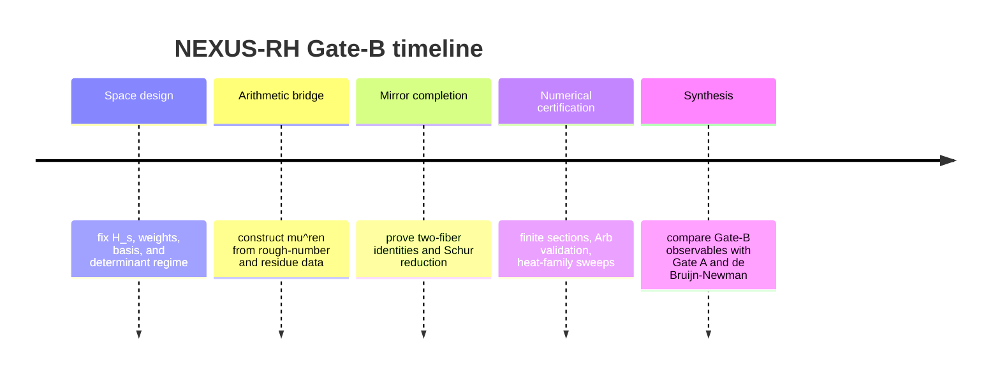

# NEXUS-RH as a Runtime-Safety Research Program

## Executive summary

The cleanest rigorous translation of the NEXUS-RH “computational metabolism” picture is not “compute \(\zeta(s)\) and look for scalar zeroes,” but “build a doubled arithmetic-reflection operator and prove that no off-seam runtime closes into a self-sustaining loop.” In ordinary operator language, that means choosing a weighted Mellin/log-space Hilbert bundle, defining a renormalized arithmetic cascade from Buchstab/rough-number data, defining a functional-equation mirror with inversion, and proving that the resulting round-trip operator has no eigenvalue \(1\) for \(\Re(s)>\tfrac12\). The one-step target
\[
\ker(I+\mathbb L_s)=\{0\}
\]
is equivalent, by Schur complement, to
\[
1\notin \operatorname{Spec}(R_s),
\]
where \(R_s\) is the round-trip \(J_R(s)K_{1-s}^{\mathrm{ren}}J_R(1-s)K_s^{\mathrm{ren}}\). The stronger bound \(\|\mathbb L_s\|<1\) is useful as a stripwise sufficient condition, but it should not be elevated to the main theorem target near the seam. That shift from raw contraction to spectral exclusion is mathematically appropriate and matches the operator-theoretic direction already implicit in NEXUS. ([arxiv.org](https://arxiv.org/abs/math/0202141))

The program is viable because each ingredient has a strong classical counterpart. Buchstab identities and rough-number counts admit Mellin/Laplace representations, including explicit one-sided Laplace transforms of the Buchstab function. Fredholm determinant numerics are well developed for scalar kernels and now also for matrix-valued kernels on the real line under trace-class and Hilbert–Schmidt hypotheses. Heat deformation of \(\Xi\) is already the core of the de Bruijn–Newman program. And Hilbert-space/operator approaches to RH have mature antecedents in Nyman–Beurling–Báez-Duarte, Burnol’s Sonine/de Branges work, Connes’s trace-formula program, Deninger’s dynamical analogies, and Suzuki’s de Branges/canonical-system constructions. citeturn12view0turn12view1turn17view0turn13view3turn17view4turn14view6turn12view5turn4search9turn14view5turn14view7

The de Bruijn–Newman connection is the right calibration layer. De Bruijn introduced the heat-family setting, Newman proved existence of a threshold constant \(\Lambda\), Rodgers and Tao proved \(\Lambda\ge 0\), and Polymath 15 proved the unconditional upper bound \(\Lambda\le 0.22\). Thus fixed mathematics already identifies RH with an exact seam condition: if RH is true, then \(\Lambda=0\). In NEXUS language, \(\lambda\) is a mathematically honest “fold-pressure” parameter. But any internal NEXUS constant \(H\) — including a conjectural value such as \(\pi/9\) — must be treated only as a calibration observable extracted from Gate-B data, never as a theorem-level identity with \(\Lambda\). citeturn0search0turn0search1turn0search7turn14view0turn14view1

The numerical program should therefore prioritize four concrete tasks. It should construct \(K_s^{\mathrm{ren}}\) and \(K_{1-s}^{\mathrm{ren}}\) from segmented-sieve and rough-number data, assemble \(\mathbb J_R(s)\) from the zeta functional equation and inversion, compute \(s_{\min}(I-R_s)\), \(\operatorname{dist}(1,\operatorname{Spec}(R_s))\), \(\|\mathbb L_s\|\), and determinant surrogates \(\det_2(I-R_s)\), and then map smoothed residue data \(I(x)\) to operator coefficients by Mellin windows. For public validation data, the strongest current stack is LMFDB/Platt for zeta zeros, together with Arb/FLINT for rigorous certification and mpmath for prototyping. LMFDB states that its zeta-zero database contains the first \(103{,}800{,}788{,}359\) zeros above the real axis, all with real part \(1/2\), while Platt and Trudgian rigorously verified RH up to height \(3\cdot 10^{12}\) using interval arithmetic. Arb provides rigorous ball arithmetic and explicit support for zeta/L-function work, and mpmath provides arbitrary-precision floating-point and interval-style prototyping. citeturn1search3turn13view4turn14view2turn10view5turn14view3

## NEXUS lens and formalization

In a strict NEXUS interpretation, a **domain** is not a collection of scalar values but a structured state space together with valid query protocols and admissible return maps. A **nexus** is the structural interface linking two such domains. For RH, the arithmetic domain is the prime/rough-number ledger, the analytic domain is the functional-equation mirror, and the runtime-safety question is whether the closed arithmetic-reflection loop can sustain an illegal off-seam mode. This interpretation does not replace analysis; it tells us what kind of object to build.

A mathematically workable default is a weighted Mellin/log-space Hilbert space
\[
H_s
:=
L^2\!\left(\mathbb R_+,\;x^{2\sigma-1}\rho_\eta(\log x)\,\frac{dx}{x}\right),
\qquad
s=\sigma+it,\quad \eta>0,
\]
with
\[
\rho_\eta(u):=e^{-2\eta |u|}.
\]
The log-space unitary
\[
(U_sf)(u):=e^{(\sigma-\frac12)u}\rho_\eta(u)^{1/2}f(e^u)
\]
identifies \(H_s\) with a weighted \(L^2(\mathbb R,du)\) space. This is a model choice, not a canonical theorem, but it is natural because Mellin inversion is the native transform for multiplicative/arithmetic dynamics and because Buchstab recursions are threshold processes on log-scale. The Nyman–Beurling criterion, Burnol’s Hilbert-space/Sonine work, and Suzuki’s Weil-distribution/de Branges constructions all make clear that weighted Hilbert-space reformulations are a legitimate RH strategy class. citeturn17view4turn14view6turn14view5turn14view7

The arithmetic cascade should be a renormalized Mellin-type integral operator
\[
K_s^{\mathrm{ren}}:H_s\to H_s,
\]
defined on log-space by
\[
(\widetilde K_s^{\mathrm{ren}}F)(u)
=
\int_{\mathbb R}\widetilde k_s^{\mathrm{ren}}(u,v)\,F(v)\,dv,
\]
with a kernel of the schematic form
\[
\widetilde k_s^{\mathrm{ren}}(u,v)
=
q_\eta(u)\,q_\eta(v)\,\mathbf 1_{v\le u}\,e^{-s(u-v)}\kappa^{\mathrm{ren}}(u-v),
\qquad q_\eta(u)=e^{-\eta|u|}.
\]
Here \(\kappa^{\mathrm{ren}}\) is not assumed; it is the **open modeling object** extracted from signed Buchstab/least-prime-factor data after explicit subtraction of boundary/main terms. The arithmetic justification is standard: Fan’s modern treatment of rough numbers records Buchstab’s identity
\[
\Phi(x,y)=\Phi(x,z)+\sum_{y<p\le z}\sum_{v\ge 1}\Phi(x/p^v,p),
\]
and Lagarias records both the defining differential-difference equation for the Buchstab function and its meromorphic one-sided Laplace transform. Those are exactly the classical ingredients needed to turn rough-number recursion into a Mellin/log-space runtime operator. citeturn12view0turn12view1

The mirror is a bounded map
\[
J_R(s):H_{1-s}\to H_s,
\qquad
(J_R(s)f)(x):=j_R(s)\,x^{1-2\sigma}f(1/x),
\]
where
\[
j_R(s):=\chi(s)^{-1}\frac{E_R(s)}{E_R(1-s)}.
\]
The fixed part is the standard functional-equation multiplier \(\chi(s)\), defined by the zeta reflection law; DLMF gives the reflection formulas and the completed \(\xi\)-function
\[
\xi(s)=\tfrac12 s(s-1)\pi^{-s/2}\Gamma(s/2)\zeta(s),
\qquad
\xi(s)=\xi(1-s).
\]
The optional finite Euler dressing
\[
E_R(s)=\prod_{p\mid R}(1-p^{-s})^{-1}
\]
is a NEXUS-style finite-wheel compensation; it is useful experimentally, but in a continuum proof it should be treated as an open choice until justified analytically. The structural requirement is
\[
J_R(s)J_R(1-s)=I.
\]
This is the rigorous way to encode the NEXUS claim that the “mirror” must be a genuine reflection/inversion and not merely a scalar multiplier. citeturn18search2

The doubled bundle is then
\[
\mathbb H_s:=H_s\oplus H_{1-s},
\]
with
\[
\mathbb K_s:=
\begin{pmatrix}
K_s^{\mathrm{ren}}&0\\
0&K_{1-s}^{\mathrm{ren}}
\end{pmatrix},
\qquad
\mathbb J_R(s):=
\begin{pmatrix}
0&J_R(s)\\
J_R(1-s)&0
\end{pmatrix},
\]
and
\[
\mathbb L_s:=\mathbb J_R(s)\mathbb K_s.
\]
The one-step targets requested in your specification are
\[
\ker(I+\mathbb L_s)=\{0\},
\qquad
\|\mathbb L_s\|<1,
\qquad
\Re(s)>\tfrac12.
\]
The more robust NEXUS/Gate-B target is the round-trip operator
\[
R_s:=J_R(s)K_{1-s}^{\mathrm{ren}}J_R(1-s)K_s^{\mathrm{ren}}:H_s\to H_s,
\]
because Schur complement gives
\[
-1\in \operatorname{Spec}(\mathbb L_s)
\iff
1\in \operatorname{Spec}(R_s).
\]
So the runtime-safety theorem should ultimately be stated as
\[
1\notin \operatorname{Spec}(R_s)\qquad(\Re(s)>\tfrac12),
\]
or, more strongly, as a weighted coercive estimate
\[
(I-R_s)^*W_s(I-R_s)\ge c_s\,W_s.
\]
This is the right formal landing place for the NEXUS idea that “off-seam the runtime should not admit self-consistent closure.” No scalar-zero language is needed at the proof target. 

The operator-class conditions are precise. If \(\widetilde k_s^{\mathrm{ren}}\in L^2(\mathbb R^2)\), then \(K_s^{\mathrm{ren}}\) is Hilbert–Schmidt and hence compact. If one can factor \(K_s^{\mathrm{ren}}=AB\) with \(A,B\) Hilbert–Schmidt, then \(K_s^{\mathrm{ren}}\) is trace class. More generally, one may invoke kernel criteria of the Delgado–Ruzhansky type to enforce membership in a chosen Schatten class \(S_p\). For determinant theory this means:
\[
R_s\in \mathcal S_1 \implies \det(I-R_s)\ \text{exists},
\]
\[
R_s\in \mathcal S_2 \implies \det_2(I-R_s)\ \text{exists}.
\]
Bornemann’s numerical theory and Gallo–Zweck–Latushkin’s matrix-valued extension are exactly the right references for the finite-section/determinant side, while Delgado–Ruzhansky provides a natural kernel-to-Schatten framework for the analytic side. citeturn15search0turn17view0turn13view3

The open modeling choices and recommended defaults are:

| Choice | Recommended default | Status |
|---|---|---|
| Weight in \(H_s\) | \(\rho_\eta(u)=e^{-2\eta|u|}\), \(\eta=0.5\) | open modeling choice |
| Prime-density placement | keep prime density in kernel, not in norm | open modeling choice |
| Arithmetic source | signed Buchstab / least-prime-factor renormalization | open modeling choice |
| Finite Euler dressing \(E_R\) | disabled by default in continuum proofs; enabled in wheel experiments | open modeling choice |
| Basis | log-Laguerre | recommended default |
| Prototype cutoff | \(x_{\max}=10^6\) | recommended default |
| Floating tolerance | \(10^{-12}\) | recommended default |
| Certified validation | Arb/FLINT ball arithmetic to \(10^{-30}\) on critical runs | recommended default |
| Determinant target | \(\det_2\) by default; upgrade to \(\det\) only after trace-class proof | recommended default |

## Bridge lemmas and proof strategy

The first required bridge is the arithmetic-to-operator map.

**Interior-residue transfer lemma.** Assume that the interior residue channel \(I(x)\), after explicit boundary subtraction, admits a smoothed least-prime-factor representation
\[
I(x)=\int_0^{\log x}\Psi(\log x-\tau)\,d\mu^{\mathrm{ren}}(\tau)+B(x),
\]
with \(B(x)\) explicit and \(d\mu^{\mathrm{ren}}\) a signed finite-energy log-break measure. Let \(W\) be a smooth compactly supported Mellin window. Then for \(\Re(s)>\tfrac12+\varepsilon\),
\[
\int_1^\infty I(x)W(x/X)x^{-s}\frac{dx}{x}
=
\langle K_s^{\mathrm{ren}}\phi_{X,s},\psi_{X,s}\rangle_{H_s}
+
E_{X,W}(s),
\]
where \(E_{X,W}(s)\) comes only from the explicit boundary term. If the resulting log-space kernel is square-integrable, then \(K_s^{\mathrm{ren}}\in \mathcal S_2\). If, in addition, it satisfies a trace-class criterion by factorization or a suitable kernel regularity theorem, then \(K_s^{\mathrm{ren}}\in\mathcal S_1\). The proof uses Buchstab’s identity, Mellin/Laplace transforms, explicit boundary subtraction, and then Hilbert–Schmidt or trace-class criteria for integral operators. citeturn12view0turn12view1turn15search0

The second bridge is the doubled mirror.

**Two-fiber mirror correctness lemma.** Assume \(J_R(s):H_{1-s}\to H_s\) is bounded and involutive and that
\[
J_R(s)K_{1-s}^{\mathrm{ren}}J_R(1-s)=K_s^{\mathrm{ren}}+E_s,
\]
with \(E_s\) determinant-class on the strip under consideration. Then
\[
I+\mathbb L_s=
\begin{pmatrix}
I & J_R(s)K_{1-s}^{\mathrm{ren}}\\
J_R(1-s)K_s^{\mathrm{ren}} & I
\end{pmatrix}
\]
is invertible if and only if the Schur complement
\[
S_s:=I-R_s,
\qquad
R_s:=J_R(s)K_{1-s}^{\mathrm{ren}}J_R(1-s)K_s^{\mathrm{ren}},
\]
is invertible on \(H_s\). Equivalently,
\[
\ker(I+\mathbb L_s)=\{0\}
\iff
\ker(I-R_s)=\{0\}.
\]
The proof is the standard block-operator Schur-complement identity; under trace-class assumptions one also obtains the determinant relation
\[
\det(I+\mathbb L_s)=\det(I-R_s).
\]
This lemma is what turns the NEXUS “two-fiber mirror” into a precise runtime-safety theorem: illegal one-step states correspond exactly to fixed points of the round trip.

The third bridge is the actual exclusion argument.

**Shape-fit exclusion lemma.** Fix a strip \( \tfrac12+\varepsilon \le \Re(s)\le \sigma_0 \), and let \(P_N\) be finite-rank projections adapted to the chosen basis. Assume finite-section convergence
\[
P_NR_sP_N\to R_s
\]
in \(\mathcal S_2\)-norm, or in trace norm where available. If either
\[
\sup_{s\text{ in strip}}\|R_s\|<1,
\]
or more generally
\[
\inf_{N\ge N_0}\inf_{s\text{ in strip}} s_{\min}(I-P_NR_sP_N)\ge \delta_\varepsilon>0,
\]
then \(1\notin \operatorname{Spec}(R_s)\) throughout the strip, hence \(\ker(I+\mathbb L_s)=\{0\}\) there. The first case is Neumann series. The second uses finite-section convergence, singular-value stability, and determinant continuity in Schatten classes. If finite-section characteristic polynomials can be expressed as images of stable polynomials under stability-preserving maps, Borcea–Brändén provides an auxiliary hyperbolicity/stability mechanism for the approximants; this does not replace spectral analysis, but it can control crossing events in parameter families. citeturn17view0turn13view3turn3search9

The standard analytic toolkit for these lemmas is therefore clear.

| Bridge | Primary tools |
|---|---|
| \(I(x)\to K_s^{\mathrm{ren}}\) | Buchstab identity, Mellin transform, Laplace transform, kernel regularization, Schatten criteria |
| two-fiber mirror | zeta functional equation, inversion \(x\mapsto1/x\), Schur complement, determinant identities |
| shape-fit exclusion | finite sections, \(\det_2\), singular-value lower bounds, Nyström quadrature, Borcea–Brändén where polynomialized approximants exist |

A crucial NEXUS-specific warning belongs here. In finite lattice/wheel models, raw operator norms can be contaminated by shell or boundary resonances. For that reason, the research program should treat \(\|\mathbb L_s\|<1\) as a sufficient diagnostic, not as the final conceptual target, and should prioritize \(1\notin \operatorname{Spec}(R_s)\), weighted coercivity, and — where necessary — Schur reduction that separates boundary-dominated sectors from the interior closure channel.

## Heat calibration and Gate A context

In the classical de Bruijn–Newman family,
\[
H_\lambda(z)=\int_0^\infty e^{\lambda u^2}\Phi(u)\cos(zu)\,du,
\]
de Bruijn’s work and Newman’s 1976 work together imply a unique threshold constant \(\Lambda\) such that “all zeros real” holds exactly for \(\lambda\ge \Lambda\). Newman’s formulation makes RH equivalent to \(\Lambda\le 0\), Rodgers and Tao proved \(\Lambda\ge 0\), and Polymath 15 established the unconditional upper bound \(\Lambda\le 0.22\). So, in fixed mathematics, RH is equivalent to the exact seam condition \(\Lambda=0\). citeturn0search0turn0search1turn0search7turn14view0turn14view1

That gives an honest way to define a Gate-B heat family:
\[
\mathbb L_{s,\lambda}:=\mathbb J_R(s)\,\mathbb K_{s,\lambda}^{\mathrm{ren}},
\]
where \(\mathbb K_{s,\lambda}^{\mathrm{ren}}\) is obtained by Gaussian heat regularization on the log-space kernel, for example
\[
\widehat{\widetilde k}_{s,\lambda}^{\mathrm{ren}}(\xi,\eta)
=
e^{-\lambda(\xi-\eta)^2}
\widehat{\widetilde k}_{s}^{\mathrm{ren}}(\xi,\eta).
\]
This choice is still open, but the rule is strict: \(\lambda\) must act as a genuine heat deformation on the arithmetic runtime, not as an arbitrary damping knob. In NEXUS language, \(\lambda\) is then the mathematically grounded version of fold-pressure.

A candidate internal constant \(H\) should be tested only through normalized observables, never assumed to equal \(\Lambda\). Recommended calibration observables are
\[
R_1(\sigma,t;N):=\frac{\operatorname{dist}(1,\operatorname{Spec}(R_s^{(N)}))}{\sigma-\frac12},
\]
\[
R_2(\sigma,t;N):=\frac{s_{\min}(I-R_s^{(N)})}{\sigma-\frac12},
\]
\[
R_3(\sigma,t;N):=
-\frac{\partial}{\partial\lambda}
\log\det_2(I-R_{s,\lambda}^{(N)})
\Big|_{\lambda=0}
\frac{1}{\log(2+|t|)}.
\]
If a candidate value such as \(\pi/9\) is real inside Gate B, it should emerge as a stable asymptotic limit of some agreed normalization of \(R_1,R_2,R_3\) across basis choices, cutoffs, and \(t\)-windows. If it does not survive those invariance tests, it should be rejected. This is the only rigorous way to let the broader NEXUS ontology speak to RH without confusing heuristic geometry with theorem-level content.

Gate A belongs here as a compile-time calibration layer. Pólya’s 1927 criterion links RH to hyperbolicity of associated Jensen polynomials; Griffin–Ono–Rolen–Zagier proved hyperbolicity for a density-\(1\) subset at each fixed degree and for all degrees \(d\le 8\); Griffin et al. later made the \(\xi\)-function result effective; O’Sullivan gave refined asymptotic criteria; and Farmer argues that Jensen-polynomial hyperbolicity is not a plausible main route to proving RH. In this research program, Gate A should therefore be used to sanity-check any proposed Gate-B normalization, not as a substitute for Gate B. citeturn8search14turn13view6turn10view9turn13view8turn13view7

## Numerical program and reproducibility

The experimental program should be operator-first. The arithmetic side begins with a segmented sieve and least-prime-factor table up to \(x_{\max}\), from which one computes rough-number counts \(\Phi(x,y)\), Möbius data, and any project-specific interior-residue stream \(I(x)\). Fan’s explicit rough-number work is the best modern starting point for the Buchstab side; it records both the inclusion-exclusion representation and Buchstab’s recursive identity in a numerically usable form. citeturn12view0

The mirror and analytic side should use the standard functional-equation multiplier from DLMF together with explicit inversion \(x\mapsto 1/x\). For prototype zeta/chi/Riemann–Siegel evaluation, mpmath is practical; for rigorous verification and certified zeros, Arb/FLINT is the right toolchain because it combines arbitrary-precision complex ball arithmetic with dedicated zeta/L-function, Riemann–Siegel, and zero-finding routines, including Platt’s method. citeturn18search2turn14view3turn14view2turn10view5

The public validation layer should use official zero data and certified local verification. LMFDB’s zeta-zero database and source page identify the dataset as the first \(103{,}800{,}788{,}359\) critical-line zeros and document the download/source pipeline. Platt and Trudgian provide a rigorous interval-arithmetic verification of RH up to height \(3\cdot 10^{12}\). Those sources are sufficient to anchor the \(t\)-windows used in Gate-B sweeps to reproducible public data. citeturn1search3turn1search11turn13view4

A reproducible prototype can be organized as follows.

```python
from dataclasses import dataclass
import numpy as np

@dataclass
class Config:
    x_max: int = 10**6
    eta: float = 0.5
    n_basis: int = 256
    tol_float: float = 1e-12
    tol_cert: float = 1e-30
    s_grid: tuple = (0.70, 0.65, 0.60, 0.58, 0.56, 0.54, 0.52, 0.51)
    t_grid: tuple = (0.0, 14.134725, 100.0, 1000.0, 10000.0)

def segmented_sieve_and_lpf(x_max):
    # primes, least-prime-factor table, Möbius values
    ...

def rough_counts(x_grid, y_grid, lpf):
    # Phi(x,y), interior residue I(x), boundary term B(x)
    ...

def smooth_log_break_measure(Ix, window):
    # explicit boundary subtraction -> mu_ren on log scale
    ...

def log_laguerre_basis(n_basis, eta):
    # orthonormal basis on weighted log-space
    ...

def assemble_K(s, basis, mu_ren, eta):
    # discretize K_s^{ren} via quadrature / projection
    ...

def chi(s):
    # zeta functional-equation multiplier
    ...

def euler_dressing(s, R_primes):
    ...

def assemble_J(s, basis, R_primes=None):
    # scalar multiplier times inversion matrix
    ...

def assemble_bundle(Ks, K1s, Js, J1s):
    # L_s = J_s K_s
    ...

def assemble_roundtrip(Ks, K1s, Js, J1s):
    # R_s = J_s K_{1-s} J_{1-s} K_s
    ...

def diagnostics(L, R):
    # norms, spectral distance to 1, smallest singular value, det_2
    ...
```

The key parameter choices are not facts; they are the defaults this report recommends.

| Parameter | Recommended default | Sensitivity sweep |
|---|---|---|
| \(x_{\max}\) | \(10^6\) | \(10^7,10^8\) |
| \(\eta\) in \(H_s\) | \(0.5\) | \(0.25,0.75,1.0\) |
| Basis | log-Laguerre | log-wavelets, Mellin-Fourier, Nyström nodes |
| Basis size | \(256\) | \(512,1024,2048\) |
| \(s\)-grid | \(0.70,\dots,0.51\) | finer mesh down to \(0.5005\) |
| \(t\)-grid | \(0,\gamma_1,10^2,10^3,10^4\) | LMFDB/Platt certified windows |
| Determinant regime | \(\det_2\) | full \(\det\) if trace-class proved |
| Floating tolerance | \(10^{-12}\) | tighter near seam |
| Certified tolerance | \(10^{-30}\) | tighter on determinant-critical windows |

The notebook should emit real charts, not synthetic toy figures. Because no verified experiment output accompanies this request, the correct deliverable here is a **chart specification** rather than fabricated plots.

| Chart | Data columns required | What it tests |
|---|---|---|
| spectrum cloud of \(R_s^{(N)}\) | \(\sigma,t,N,\Re\lambda,\Im\lambda\) | whether eigenvalues approach \(1\) off seam |
| spectral distance vs \(\Re(s)\) | \(\sigma,t,N,\operatorname{dist}(1,\Spec(R_s^{(N)}))\) | direct runtime-safety margin |
| \(s_{\min}(I-R_s^{(N)})\) vs \(\Re(s)\) | \(\sigma,t,N,s_{\min}\) | invertibility/coercivity proxy |
| \(\|\mathbb L_s^{(N)}\|\) vs \(\Re(s)\) | \(\sigma,t,N,\|\mathbb L_s^{(N)}\|\) | strong sufficient condition if stable |
| Neumann decay | \(\sigma,t,N,n,\|R_s^{(N)\,n}v_0\|\) | practical contraction / nonclosure behavior |
| heat response | \(\sigma,t,N,\lambda,\det_2(I-R_{s,\lambda}^{(N)})\) | fold-pressure calibration |

The computational pipeline is:

```mermaid
flowchart LR
    A[Segmented sieve and LPF tables] --> B[Rough counts Phi(x,y)]
    B --> C[Boundary subtraction and interior residue I(x)]
    C --> D[Smoothed Mellin/Laplace transform]
    D --> E[Assemble K_s^ren and K_1-s^ren]
    E --> F[Assemble J_R(s) from chi(s), inversion, optional E_R]
    F --> G[Build doubled operator L_s and round-trip R_s]
    G --> H[Compute dist(1,Spec(R_s)), s_min(I-R_s), det_2, norms]
    H --> I[Heat deformation in lambda and calibration observables]
    I --> J[Gate A cross-checks from Jensen data]
```

And the timeline is:



Reproducibility should be strict. Every run should record software stack, precision, basis, quadrature rule, \(x_{\max}\), \(N\), \(s\)-grid, \(t\)-window source, and whether values are floating or interval-certified. Public-zero windows should be named by LMFDB/Platt references, and critical runs should be rerun with Arb/FLINT ball arithmetic. That is necessary because seam-adjacent determinant and singular-value computations are exactly where silent precision loss can mimic spectral events. citeturn13view4turn14view2turn14view3

## Deliverables, prioritized sources, and open questions

The research deliverables should be concrete.

| Deliverable | Required content |
|---|---|
| formal operator note | precise \(H_s\), \(K_s^{\mathrm{ren}}\), \(J_R(s)\), \(\mathbb L_s\), \(R_s\), determinant regime, open choices |
| bridge-lemma manuscript | the three lemmas above with explicit hypotheses and proof skeletons |
| reproducible notebook | arithmetic pipeline, operator assembly, diagnostics, CSV export, exact environment |
| certified seam scans | Arb-backed values of \(s_{\min}(I-R_s)\), \(\operatorname{dist}(1,\Spec(R_s))\), and \(\det_2(I-R_s)\) |
| Gate-B heat note | definition of \(\mathbb L_{s,\lambda}\), \(R_1,R_2,R_3\), and candidate-\(H\) calibration tests |
| Gate A comparison note | Jensen data versus Gate-B diagnostics under fixed normalization choices |

The prioritized source stack should be anchored in primary and official English sources. For the heat side: de Bruijn 1950, Newman 1976, Rodgers–Tao, and Polymath 15. For rough-number arithmetic: Fan 2023 and Lagarias’s survey sections on the Buchstab function and its Laplace transform. For Gate A: Pólya’s 1927 paper, GORZ 2019, the 2022 \(\xi\)-function paper, and O’Sullivan 2020, with Farmer’s critique as a methodological caution. For operator antecedents: Báez-Duarte, Burnol, Connes, Deninger, Suzuki, and de Branges-space/canonical-system references. For numerics: Bornemann, Gallo–Zweck–Latushkin, LMFDB, Platt–Trudgian, Arb/FLINT, and mpmath. citeturn0search0turn0search1turn14view0turn14view1turn12view0turn12view1turn8search14turn13view6turn10view9turn13view8turn13view7turn17view4turn14view6turn12view5turn4search9turn14view7turn17view0turn13view3turn1search3turn13view4turn14view2turn14view3

The main open questions are narrow and decisive. The exact renormalized arithmetic kernel \(\kappa^{\mathrm{ren}}\) is still a modeling object rather than a theorem. Trace class may fail on the first pass, in which case \(\det_2\) must be the primary determinant object. The strong norm target \(\|\mathbb L_s\|<1\) may only hold on strips bounded away from \(\tfrac12\), so weighted coercivity or direct spectral distance to \(1\) may become the true theorem path. Internal candidate constants such as \(H\) must survive basis- and cutoff-invariant calibration tests before they deserve mathematical status. And project-local finite-shell resonances should be treated as diagnostics of truncation geometry unless they persist in Schur-reduced, continuum-stable observables. None of these are reasons to abandon the program. They are the exact points where the NEXUS lens ceases to be metaphor and becomes a disciplined research agenda.

The domain/nexus framing matters beyond RH because it forces a helpful methodological inversion. A “domain” is the structured state space plus valid observables; a “nexus” is the structure-preserving interface linking domains; a runtime-safety theorem says that no illegal self-reinforcing loop exists after forward evolution plus return reflection. In the RH case the arithmetic domain and analytic mirror are the concrete instantiation. In other targets — operator-theoretic dynamical systems, inverse scattering, or model-space criteria — the same pattern reappears with different kernels and mirrors. That is the correct sense in which NEXUS expands beyond RH: not by replacing proofs with ontology, but by insisting that the right proof object is a structural closure law, not a scalar value channel.