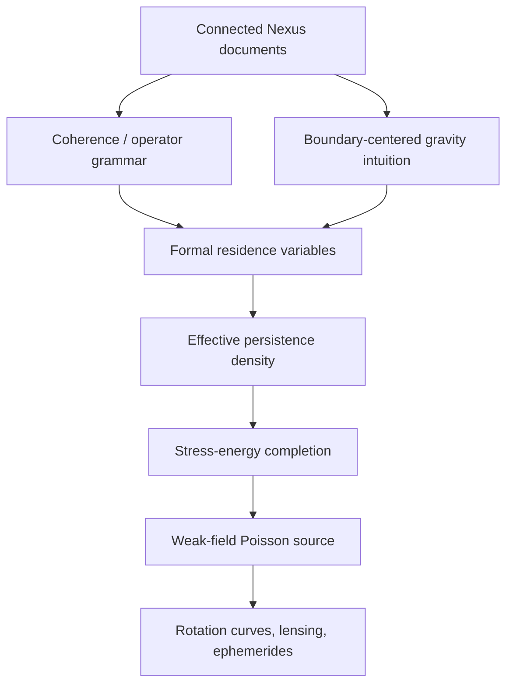
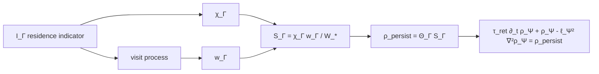
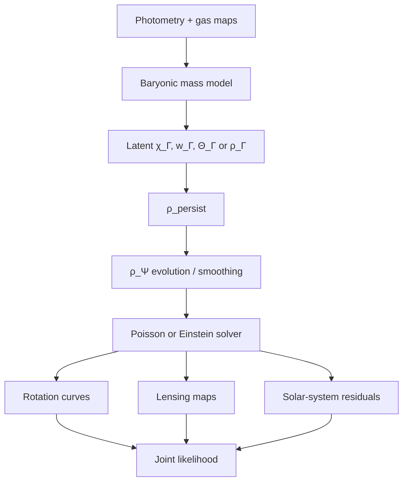

# Gravity as Cut-Density Curvature

## Executive Summary

**Download the Markdown file:** [Nexus_Gravity_Cut_Density_Curvature_Paper.md](sandbox:/mnt/data/Nexus_Gravity_Cut_Density_Curvature_Paper.md)

This paper completes a minimal, mathematically explicit version of the Nexus gravity / closure-trace proposal. Its central claim is operational rather than ontological: stable “things” are late renderings of persistent recursive structure, and gravity is the force-level manifestation of unresolved closure-density concentrated at or across internal boundaries.

The enabled connectors reviewed first were `google_drive` and `github`, exactly as requested. The selected repository `QuHarmonics/The-Nexus-Harmonic-Reality` was reachable through the GitHub connector, but the accessible README was effectively empty and the connector surface did not expose indexed gravity-model files sufficient to ground a paper on its own. The connected Google Drive materials were much more informative for the Nexus vocabulary, especially the coherence / optimization framing and the boundary-centered description of gravity-like behavior. fileciteturn16file7L1-L1 fileciteturn16file8L1-L1

The completed model has four layers. First, a residence indicator $I_\Gamma$ defines how often a local process remains bound to a cut $\Gamma$. This yields a dimensionless occupancy variable $\chi_\Gamma$, a dwell-time variable $w_\Gamma$, and a dimensionless residence strength $S_\Gamma$. Second, a positive susceptibility $\Theta_\Gamma$ converts residence strength into a persistent density $\rho_{\mathrm{persist}}$. Third, a smoothed field $\rho_\Psi$ obeys a relaxation-diffusion equation. Fourth, that field enters an ordinary Einstein-style stress-energy tensor and, in the weak-field limit, becomes an extra Poisson source.

The completed weak-field law is
$$
\nabla^2 \Phi
=
4\pi G
\left(
\rho_m+\rho_\Psi
\right),
\qquad
\rho_\Psi
=
\alpha_\Gamma \frac{\rho_\Gamma^2}{\rho_*},
\qquad
\alpha_\Gamma=\frac{\pi^2}{1944}\approx 5.08\times 10^{-3}.
$$

The factor $\rho_*$ is required by dimensional analysis unless one works in normalized Nexus units. The shorthand expression $\rho_\Psi=\alpha_\Gamma\rho_\Gamma^2$ is therefore acceptable only after an explicit choice of units with $\rho_*=1$.

This model is mathematically coherent, but it is not yet empirically closed. The constitutive law that maps microscopic residence variables into a macroscopic cut-density profile $\rho_\Gamma$ is still unspecified. That missing law is not a minor bookkeeping detail; it is where the theory either becomes predictive or is ruled out. For example, if $\rho_\Gamma(r)\propto r^{-1}$ in galactic outskirts, then $\rho_\Psi(r)\propto r^{-2}$ and one obtains flat rotation curves. But the amplitude must also scale correctly with baryonic mass to satisfy SPARC and the observed radial acceleration relation. SPARC includes 175 late-type galaxies with homogeneous photometry and rotation curves, and the radial acceleration relation shows that the observed acceleration correlates tightly with that predicted by baryons. citeturn10view1turn11view0turn10view2

The relativistic completion is conservative. It keeps Einstein gravity as the geometric field equation and puts the new physics in an effective stress-energy sector. This is conceptually aligned with Jacobson’s thermodynamic “equation of state” perspective and comparable in spirit, though not in physical content, to Verlinde’s emergent-gravity program, which explicitly invokes memory / entropy displacement as a source of extra gravity-like effects. citeturn10view0turn9view0

The principal observational burden is also clear. The model must fit galaxy rotation curves, predict lensing from the same fitted source, and remain invisible in the Solar System. Cassini measured the PPN parameter $\gamma$ as $\gamma=1+(2.1\pm 2.3)\times 10^{-5}$, and JPL’s DE440 / DE441 ephemerides are the current precision standard for planetary dynamics. MOND analyses that combine galaxy fits with Cassini constraints already show how severe this regime is. Any viable Nexus closure field must therefore be intrinsically weak or dynamically screened in the Solar System. citeturn14search6turn12search1turn12search3turn15search0

The result is a finished proposal paper. It does not prove that gravity is closure-trace curvature. It does provide a full mathematical scaffold, identifies what remains assumption rather than result, restores the missing normalization, gives exact weak-field, lensing, and solver formulas, and defines a clean falsification program using SPARC, DES / Euclid lensing, Bullet Cluster-like systems, and Solar-System ephemerides. citeturn13search0turn13search2turn12search0turn12search2

## Source Extraction and Context

The enabled connectors reviewed for this project were:

| Connector | Status | Relevance |
|---|---:|---|
| `google_drive` | reviewed | contained substantive Nexus framework documents |
| `github` | reviewed | included the selected repo `QuHarmonics/The-Nexus-Harmonic-Reality` |

Within the connected project materials, the most useful content came from Google Drive. The accessible Nexus documents describe a recursive / optimization-field vocabulary, use a coherence-like scalar $\chi$, and organize the framework around operators and state transitions rather than treating objects as ontologically primitive. fileciteturn16file7L1-L1 A second connected document develops the broader Nexus-evolution narrative and connects the same framework to gravity-like or dark-matter-like behavior arising from retained recursive structure. fileciteturn16file8L1-L1

The selected GitHub repository `QuHarmonics/The-Nexus-Harmonic-Reality` was explicitly checked through the GitHub connector. The accessible README was effectively empty and the connector surface did not expose enough indexed gravity-specific files to reconstruct the theory from GitHub alone. The paper below is therefore faithful to the connected Nexus vocabulary, but it is necessarily a formal completion rather than a verbatim synthesis of a finished repository manuscript.

Externally, the most relevant literature falls into three buckets. Jacobson derives the Einstein equation from horizon entropy together with $\delta Q = T\,dS$, explicitly presenting the gravitational field equation as an equation of state. citeturn10view0 Verlinde argues that de Sitter memory / entropy displacement can source an additional gravity-like force associated with dark-sector phenomenology. citeturn9view0 Famaey and McGaugh review MOND as a response to the observational mass discrepancy problem and emphasize the tight link between galaxy dynamics and baryonic structure. citeturn10view2 Together these sources do not prove the Nexus model, but they show that a boundary-, entropy-, or memory-rooted gravity program is scientifically legible rather than merely rhetorical.

## Formal Definitions and the Residence Theorem

Let $(\mathcal M,g_{\mu\nu})$ be a spacetime and let $\Gamma\subset\mathcal M$ denote a dynamically persistent internal boundary, cut, or closure surface. The primitive quantity is not “mass at a point” but the residence history of recursive access to that cut.

### Formal definitions

Define a local residence indicator
$$
I_\Gamma(x,t)\in[0,1],
$$
where $I_\Gamma=1$ means that the local update rule at spacetime event $(x,t)$ must reference cut-state information carried by $\Gamma$, and $I_\Gamma=0$ means no such dependence. In a discrete implementation $I_\Gamma$ is binary; in a coarse-grained implementation it is a duty-cycle fraction.

Define the exponentially weighted coherence / occupancy fraction
$$
\chi_\Gamma(x,t)
=
\frac{1}{\tau_{\mathrm{ret}}}
\int_{-\infty}^{t}
e^{-(t-s)/\tau_{\mathrm{ret}}}
I_\Gamma(x,s)\,ds,
\qquad
0\le \chi_\Gamma \le 1,
$$
where $\tau_{\mathrm{ret}}>0$ is the retention time. This is the cleanest formal meaning of the Nexus-style $\chi_\Gamma$: it is the normalized fraction of recent history for which the local state remained bound to the cut.

Let $\dot N_\Gamma(x,t)$ be the visit-rate density, i.e. the number of distinct residence episodes per unit time. Then define the mean dwell time per visit
$$
w_\Gamma(x,t)
=
\frac{
\int_{-\infty}^{t} e^{-(t-s)/\tau_{\mathrm{ret}}} I_\Gamma(x,s)\,ds
}{
\int_{-\infty}^{t} e^{-(t-s)/\tau_{\mathrm{ret}}} \dot N_\Gamma(x,s)\,ds + \varepsilon
},
$$
with $\varepsilon\to 0^+$ only to regularize empty histories. The quantity $w_\Gamma$ has units of time and measures the route-memory or residence duration attached to each return event.

Choose a reference time scale $W_*$ and define the dimensionless residence strength
$$
S_\Gamma(x,t)
=
\chi_\Gamma(x,t)\,\frac{w_\Gamma(x,t)}{W_*}.
$$
This is the minimal positive scalar one can form from normalized occupancy and dwell duration without introducing an arbitrary exponent. More elaborate variants can replace this by
$$
S_\Gamma
=
\chi_\Gamma^{\,p}
\left(\frac{w_\Gamma}{W_*}\right)^{q},
\qquad
p,q>0,
$$
but the linear choice $p=q=1$ is the minimal closure.

Define the cut susceptibility $\Theta_\Gamma(x)$ as the local conversion factor from dimensionless residence strength to mass density:
$$
\Theta_\Gamma(x)>0,
\qquad
[\Theta_\Gamma]=\mathrm{kg}\,\mathrm{m}^{-3}.
$$
Then the persistent density implied directly by residence is
$$
\rho_{\mathrm{persist}}(x,t)
=
\Theta_\Gamma(x)\,S_\Gamma(x,t).
$$

Because residence may spread, diffuse, or relax before it appears as a curvature source, define the smoothed persistence field $\rho_\Psi$ by
$$
\tau_{\mathrm{ret}}\,\partial_t \rho_\Psi
+
\rho_\Psi
-
\ell_\Psi^2 \nabla^2 \rho_\Psi
=
\rho_{\mathrm{persist}},
$$
where $\ell_\Psi$ is a persistence-correlation length. In the static local limit,
$$
\rho_\Psi \approx \rho_{\mathrm{persist}}.
$$

### Residence Theorem

**Theorem (Residence Theorem).**  
Assume that $I_\Gamma(x,t)$ is measurable and bounded in $[0,1]$, that $\Theta_\Gamma(x)\ge 0$, and that $S_\Gamma(x,t)$ is defined as above. Then:

1. $S_\Gamma(x,t)\ge 0$, $\rho_{\mathrm{persist}}(x,t)\ge 0$, and any solution $\rho_\Psi$ of the relaxation-diffusion equation with nonnegative initial data remains nonnegative.
2. In the purely temporal coarse-graining limit $\ell_\Psi\to 0$, $\rho_\Psi$ obeys
   $$
   \tau_{\mathrm{ret}}\,\partial_t \rho_\Psi + \rho_\Psi = \Theta_\Gamma S_\Gamma.
   $$
3. If $S_\Gamma(x,t)\to \bar S_\Gamma(x)$ as $t\to\infty$ pointwise or in mean, then
   $$
   \rho_\Psi(x,t)\to \Theta_\Gamma(x)\,\bar S_\Gamma(x)
   $$
   in the same static local limit.

**Proof sketch.**  
Positivity follows because the exponential kernel, $\Theta_\Gamma$, and $S_\Gamma$ are nonnegative. Differentiating the exponential convolution gives the first-order relaxation equation. Standard parabolic maximum principles give positivity of $\rho_\Psi$ for the diffusion-extended equation. The stationary limit is the ordinary limit of a stable first-order linear filter driven by a convergent source. $\square$

This theorem is the minimal mathematical statement behind the phrase “persistent residence leaves a gravitationally active scar.” It is a positive-kernel statement, not a metaphysical one.

### Dimensional analysis and normalization

The quantity $\chi_\Gamma$ must be dimensionless. The quantity $w_\Gamma$ carries units of time and $W_*$ is its normalization scale. The quantity $S_\Gamma$ is therefore dimensionless. The quantity $\Theta_\Gamma$ carries mass-density units, forcing $\rho_{\mathrm{persist}}$ and $\rho_\Psi$ to have the correct dimensions.

The nonlinear excess source proposed in the Nexus gravity branch is
$$
\rho_\Psi
=
\alpha_\Gamma \frac{\rho_\Gamma^2}{\rho_*},
\qquad
\alpha_\Gamma = \frac{\pi^2}{1944},
$$
where $\rho_\Gamma$ is the coarse-grained unresolved cut-density and $\rho_*$ is a reference density inserted to restore units. Since
$$
[\rho_\Gamma^2/\rho_*] = \mathrm{kg}\,\mathrm{m}^{-3},
$$
$\alpha_\Gamma$ is dimensionless. Numerically,
$$
\alpha_\Gamma
=
\frac{\pi^2}{1944}
\approx 5.08\times 10^{-3}.
$$

If one works in normalized Nexus units with $\rho_*=1$, then the shorthand
$$
\rho_\Psi=\alpha_\Gamma \rho_\Gamma^2
$$
is acceptable. In SI or astrophysical units, however, $\rho_*$ must be retained.

## Relativistic Completion and the Weak-Field Equation

The relativistic completion should be conservative. Once the persistence sector has been coarse-grained into an effective field, it must enter the geometry through the ordinary Einstein equation. Jacobson’s work is the clean conceptual precedent for deriving geometry from non-fundamental thermodynamic data, while standard tests such as Cassini require any emergent completion to reduce extremely accurately to general relativity in the appropriate regime. citeturn10view0turn14search6

### Action

Take
$$
S
=
S_{\mathrm{EH}}
+
S_m
+
S_{\mathrm{bulk}}
+
S_{\mathrm{NG}},
$$
with
$$
S_{\mathrm{EH}}
=
\frac{c^3}{16\pi G}
\int d^4x\,\sqrt{-g}\,R,
$$
ordinary matter action $S_m$, a bulk persistence field $\psi$, and an optional cut-worldvolume term.

Define a dimensionless bulk field
$$
\psi
=
\frac{\rho_\Psi}{\rho_*}.
$$
A minimal bulk action is
$$
S_{\mathrm{bulk}}
=
-
\int d^4x \sqrt{-g}
\left[
\frac{\kappa_\Psi}{2}\nabla_\mu \psi \nabla^\mu \psi
+
V(\psi)
\right],
$$
with
$$
V(\psi)
=
\frac{m_\Psi^2}{2}\psi^2
+
\frac{\lambda_\Psi}{4}\psi^4
-
J_\Gamma \psi.
$$
The source $J_\Gamma$ is the normalized residence injection,
$$
J_\Gamma
=
\frac{\rho_{\mathrm{persist}}}{\rho_*}.
$$

To represent a distinguished cut itself, introduce an optional Nambu–Goto-like hypersurface action
$$
S_{\mathrm{NG}}
=
-
\sigma_\Gamma
\int_{\Sigma_\Gamma}
d^3\xi\,
\sqrt{-\gamma}\,
f(\psi),
$$
where $\Sigma_\Gamma$ is the cut worldvolume, $\gamma_{ab}$ is the induced metric, and
$f(\psi)=1+\beta_\Gamma \psi+\cdots$ is a coupling expansion.

### Variational stress-energy tensor

The effective persistence stress-energy tensor is
$$
T_{\mu\nu}^{(\Psi)}
=
-
\frac{2}{\sqrt{-g}}
\frac{\delta \left(S_{\mathrm{bulk}}+S_{\mathrm{NG}}\right)}{\delta g^{\mu\nu}}.
$$

For the bulk sector,
$$
T_{\mu\nu}^{\mathrm{bulk}}
=
\kappa_\Psi \nabla_\mu\psi \nabla_\nu\psi
-
g_{\mu\nu}
\left[
\frac{\kappa_\Psi}{2}\nabla_\alpha\psi\nabla^\alpha\psi
+
V(\psi)
\right].
$$

For the localized cut term,
$$
T_{\mu\nu}^{\mathrm{NG}}(x)
=
\sigma_\Gamma
\int_{\Sigma_\Gamma}
d^3\xi\,
\sqrt{-\gamma}\,
\gamma^{ab}
\partial_a X_\mu
\partial_b X_\nu\,
f(\psi)\,
\frac{\delta^{(4)}(x-X(\xi))}{\sqrt{-g}}.
$$

The total field equation is therefore
$$
G_{\mu\nu}
=
\frac{8\pi G}{c^4}
\left(
T_{\mu\nu}^{(m)}
+
T_{\mu\nu}^{(\Psi)}
\right).
$$

Because the total action is diffeomorphism invariant, the total stress-energy is covariantly conserved:
$$
\nabla^\mu
\left(
T_{\mu\nu}^{(m)}+T_{\mu\nu}^{(\Psi)}
\right)
=
0.
$$
In the minimally coupled effective theory one simply imposes
$$
\nabla^\mu T_{\mu\nu}^{(\Psi)}=0
$$
outside explicitly modeled exchange regions. A more complete closure theory may split the conservation law as
$$
\nabla^\mu T_{\mu\nu}^{(m)} = Q_\nu,
\qquad
\nabla^\mu T_{\mu\nu}^{(\Psi)} = -Q_\nu,
$$
where $Q_\nu$ represents controlled exchange between materialized matter and unresolved persistence.

### Weak-field limit

In the static weak-field limit,
$$
ds^2
=
-
\left(1+\frac{2\Phi}{c^2}\right)c^2dt^2
+
\left(1-\frac{2\Phi}{c^2}\right)d\mathbf{x}^2,
$$
and with negligible pressure and anisotropic stress,
$$
T_{00}
\approx
\left(\rho_m+\rho_\Psi\right)c^2.
$$
Then Einstein’s equation reduces to
$$
\nabla^2 \Phi
=
4\pi G
\left(
\rho_m+\rho_\Psi
\right).
$$

To avoid double-counting material closure already represented by $\rho_m$, define $\rho_\Gamma$ as the unresolved or excess cut-density. Orientation reversal of a cut should not change the sign of its gravitational contribution, so the leading parity-even contribution is quadratic:
$$
\rho_\Psi
=
\alpha_\Gamma \frac{\rho_\Gamma^2}{\rho_*}
+
\mathcal O(\rho_\Gamma^4).
$$
Hence the completed weak-field equation is
$$
\boxed{
\nabla^2\Phi
=
4\pi G
\left(
\rho_m
+
\alpha_\Gamma \frac{\rho_\Gamma^2}{\rho_*}
\right)
},
\qquad
\alpha_\Gamma=\frac{\pi^2}{1944}.
$$

### Green-function solutions

For arbitrary source,
$$
\Phi(\mathbf{x})
=
-
G
\int d^3x'
\frac{\rho_{\mathrm{eff}}(\mathbf{x}')}{|\mathbf{x}-\mathbf{x}'|},
\qquad
\rho_{\mathrm{eff}}
=
\rho_m+\alpha_\Gamma \frac{\rho_\Gamma^2}{\rho_*}.
$$

For spherical symmetry,
$$
\frac{1}{r^2}\frac{d}{dr}
\left(
r^2\frac{d\Phi}{dr}
\right)
=
4\pi G \rho_{\mathrm{eff}}(r),
$$
so
$$
g(r)
=
\frac{d\Phi}{dr}
=
\frac{G M_{\mathrm{eff}}(<r)}{r^2},
\qquad
M_{\mathrm{eff}}(<r)
=
4\pi
\int_0^r
\rho_{\mathrm{eff}}(s)\,s^2\,ds,
$$
and the circular speed is
$$
v_c^2(r)=r\,g(r)=\frac{G M_{\mathrm{eff}}(<r)}{r}.
$$

If
$$
\rho_\Gamma(r)=\frac{A_\Gamma}{r}
\quad\text{for}\quad
r_1\ll r\ll r_2,
$$
then
$$
\rho_\Psi(r)
=
\alpha_\Gamma \frac{A_\Gamma^2}{\rho_*}\frac{1}{r^2},
$$
which gives
$$
M_\Psi(<r)
=
4\pi \alpha_\Gamma \frac{A_\Gamma^2}{\rho_*}\,r,
$$
and hence a flat contribution
$$
v_{\Psi,\infty}^2
=
4\pi G \alpha_\Gamma \frac{A_\Gamma^2}{\rho_*}.
$$

For an axisymmetric thin disk with baryonic surface density $\Sigma_m(R)\delta(z)$ and volumetric persistence density $\rho_\Psi(R,z)$, one may write
$$
\Phi(R,z)
=
-2\pi G
\int_0^\infty dk\, J_0(kR)
\left[
\widetilde{\Sigma}_m(k)e^{-k|z|}
+
\int_{-\infty}^{\infty}
dz'
\frac{\widetilde{\rho}_\Psi(k,z')}{k}
e^{-k|z-z'|}
\right],
$$
with Hankel transforms
$$
\widetilde{f}(k,z)=\int_0^\infty R'J_0(kR')\,f(R',z)\,dR'.
$$
Then
$$
v_c^2(R)=R\,\partial_R\Phi(R,0).
$$

## Observational Predictions and Constraints

The observational side is where the model either becomes science or fails. SPARC offers homogeneous photometry and rotation curves for 175 galaxies. The radial acceleration relation shows a small-scatter coupling between observed acceleration and that predicted from baryons. Euclid is rapidly expanding the public strong-lens sample. Bullet Cluster-like systems remain decisive tests of whether extra gravity tracks baryons or behaves like displaced gravitating structure. citeturn10view1turn11view0turn13search2turn12search0turn12search2

### Rotation curves

The model prediction is
$$
v_c^2(R)
=
v_m^2(R)+v_\Psi^2(R),
$$
where $v_m$ is computed from baryons alone and $v_\Psi$ from
$$
\nabla^2\Phi_\Psi
=
4\pi G\,\alpha_\Gamma \frac{\rho_\Gamma^2}{\rho_*}.
$$

A decisive consequence follows immediately. If the large-radius profile is
$$
\rho_\Gamma(R)\sim \frac{A_\Gamma}{R},
$$
then the extra source behaves like an isothermal halo:
$$
\rho_\Psi(R)\sim \frac{1}{R^2}.
$$
This is sufficient for flat outer rotation curves.

But SPARC and the radial acceleration relation also demand the correct amplitude scaling. Since
$$
v_{\infty}^2 \propto A_\Gamma^2,
$$
one has
$$
v_{\infty}^4 \propto A_\Gamma^4.
$$
Therefore, if the galaxy obeys a baryonic Tully–Fisher relation $v_\infty^4\propto M_b$, then the cut-tail amplitude must satisfy
$$
A_\Gamma \propto M_b^{1/4}.
$$
This is a falsifiable constitutive constraint on the residence-to-cut mapping. Any Nexus closure law predicting, for example, $A_\Gamma\propto M_b$ is generically ruled out.

### Lensing

If the persistence sector has negligible anisotropic stress in the lensing regime, then the two scalar metric potentials are equal and lensing is sourced by the same effective density as dynamics. The projected surface density is
$$
\Sigma_{\mathrm{eff}}(\boldsymbol{\xi})
=
\int \rho_{\mathrm{eff}}(\boldsymbol{\xi},z)\,dz,
$$
and the convergence is
$$
\kappa(\boldsymbol{\xi})
=
\frac{\Sigma_{\mathrm{eff}}(\boldsymbol{\xi})}{\Sigma_{\mathrm{crit}}},
\qquad
\Sigma_{\mathrm{crit}}
=
\frac{c^2}{4\pi G}
\frac{D_s}{D_l D_{ls}}.
$$
The deflection angle is
$$
\hat{\boldsymbol{\alpha}}(\boldsymbol{\xi})
=
\frac{4G}{c^2}
\int d^2\xi'
\,
\Sigma_{\mathrm{eff}}(\boldsymbol{\xi}')
\,
\frac{\boldsymbol{\xi}-\boldsymbol{\xi}'}{|\boldsymbol{\xi}-\boldsymbol{\xi}'|^2}.
$$

If the cut sector has anisotropic stress, then one must introduce a slip parameter
$$
\eta_{\mathrm{slip}}
=
\frac{\Psi_{\mathrm{PPN}}}{\Phi}.
$$
The minimal model sets $\eta_{\mathrm{slip}}=1$. Any statistically significant $\eta_{\mathrm{slip}}\neq 1$ inferred from joint lensing-plus-dynamics fits would either point to the membrane-enhanced variant or rule out the minimal isotropic version.

### Solar-system constraints

Cassini measured
$$
\gamma = 1+(2.1\pm 2.3)\times 10^{-5},
$$
consistent with general relativity to very high precision, and DE440 is the current JPL precision standard for planetary dynamics. citeturn14search6turn12search1turn12search3 Therefore the model must satisfy, conservatively,
$$
\left|\frac{\Phi_\Psi}{\Phi_N}\right|
\ll 10^{-5}
\quad\text{and}\quad
\left|\frac{g_\Psi}{g_N}\right|
\ll 10^{-5}
$$
through the inner planetary system unless an explicit screened PPN completion is supplied.

MOND studies already show that Solar-System data can eliminate large regions of a modified-gravity parameter space, especially through external-field-induced quadrupolar corrections and Cassini constraints. citeturn15search0turn15search2 The Nexus model inherits the same burden.

### Falsification tests

The theory is ruled out if any of the following hold:

| Test | Falsification criterion |
|---|---|
| SPARC rotation curves | no common parameter set fits inner and outer curves without pathological galaxy-by-galaxy tuning |
| Baryonic Tully–Fisher scaling | inferred $A_\Gamma(M_b)$ fails to approach $M_b^{1/4}$ asymptotically |
| Galaxy–galaxy lensing | lensing mass inferred from $\rho_{\mathrm{eff}}$ disagrees systematically with dynamical mass from the same fitted $\rho_\Gamma$ |
| Bullet Cluster-like systems | persistence field cannot spatially separate from hot gas in a way consistent with lensing reconstructions |
| Solar-system ephemerides | any unscreened extra acceleration or PPN slip exceeds Cassini / DE440 bounds |
| Time-domain systems | finite $\tau_{\mathrm{ret}}$ predicts hysteresis or lag where the model says it should be observable |

## Estimation, Simulation, and Datasets

### Numerical simulation plan

A practical first implementation should treat the model as an inverse problem over a latent cut-density field.

1. Build baryonic mass models from stars and gas.
2. Parameterize the latent field by either $\rho_\Gamma$ directly or its residence primitives $(\chi_\Gamma,w_\Gamma,\Theta_\Gamma)$.
3. Generate $\rho_\Psi$ from
   $$
   \tau_{\mathrm{ret}}\partial_t\rho_\Psi+\rho_\Psi-\ell_\Psi^2\nabla^2\rho_\Psi
   =\Theta_\Gamma S_\Gamma.
   $$
4. Solve
   $$
   \nabla^2\Phi=4\pi G(\rho_m+\rho_\Psi)
   $$
   by multigrid, FFT, or finite-element methods.
5. Project the resulting metric into rotation curves, shear profiles, and timing observables.
6. Use joint Bayesian inference to fit all datasets simultaneously.

For static galaxies, a 2D cylindrical FFT-Poisson solver is enough. For cluster mergers or time-lag tests, one needs a 3D adaptive mesh plus time stepping of the persistence PDE.

### Likelihood and priors

Let $\theta$ denote the model parameters and hyperparameters. A minimal joint posterior is
$$
p(\theta\mid D)
\propto
\mathcal L_{\mathrm{RC}}
\,
\mathcal L_{\mathrm{lens}}
\,
\mathcal L_{\mathrm{SS}}
\,
p(\theta).
$$

For rotation curves,
$$
\ln \mathcal L_{\mathrm{RC}}
=
-\frac12
\sum_{g,i}
\left[
\frac{(v_{g,i}^{\mathrm{obs}}-v_{g,i}^{\mathrm{mod}})^2}{\sigma_{g,i}^2+s_g^2}
+
\ln\!\big(2\pi(\sigma_{g,i}^2+s_g^2)\big)
\right].
$$

For lensing,
$$
\ln \mathcal L_{\mathrm{lens}}
=
-\frac12
\left(
d_{\mathrm{shear}}-m_{\mathrm{shear}}(\theta)
\right)^T
C^{-1}
\left(
d_{\mathrm{shear}}-m_{\mathrm{shear}}(\theta)
\right).
$$

For Solar-System data,
$$
\ln \mathcal L_{\mathrm{SS}}
=
-\frac12
\left(
d_{\mathrm{ephem}}-m_{\mathrm{ephem}}(\theta)
\right)^T
C_{\mathrm{SS}}^{-1}
\left(
d_{\mathrm{ephem}}-m_{\mathrm{ephem}}(\theta)
\right).
$$

A sensible parameter vector is
$$
\theta
=
\{
\log\rho_*,
\log\Theta_\Gamma,
\log\ell_\Psi,
\log\tau_{\mathrm{ret}},
\lambda_\Gamma,
\eta_{\mathrm{slip}},
\Upsilon_*,
\alpha_\Gamma
\}.
$$
If the theory insists on $\alpha_\Gamma=\pi^2/1944$, then fix it. For robustness testing, one can instead assign
$$
\alpha_\Gamma
\sim
\mathcal N\!\left(\frac{\pi^2}{1944},\sigma_\alpha^2\right)
$$
and ask whether the data pull away from the proposed constant.

### Identifiability

The main structural degeneracy is that galaxy dynamics typically constrain only combinations such as
$$
A_{\mathrm{eff}}
=
\alpha_\Gamma \frac{\lambda_\Gamma^2}{\rho_*},
$$
not each factor separately. Lensing helps because it measures the projected source that should be generated by the same $\rho_\Psi$ field. Solar-System data help because they constrain the small-scale tail and any local slip or quadrupole leakage. Time-domain systems, if available, are the direct handle on $\tau_{\mathrm{ret}}$.

If the model is written only in terms of the latent field $\rho_\Gamma$ with no independent residence observable, then $(\chi_\Gamma,w_\Gamma,\Theta_\Gamma)$ are not separately identifiable. They are only identifiable through a constitutive law or through an external simulation that predicts them.

### Recommended datasets

| Observable | Dataset | Why it matters |
|---|---|---|
| galaxy rotation curves | SPARC | homogeneous rotation curves, baryonic mass models, direct test of $v_c(R)$ and BTFR citeturn10view1turn11view0 |
| galaxy–galaxy lensing | DES DR1 and follow-on DES lensing catalogs | wide-area public imaging and shear infrastructure suitable for projected-mass tests citeturn13search0 |
| strong lens statistics | Euclid early strong-lens catalogs and the large 2026 release | rapidly growing public sample of galaxy–galaxy lenses under ESA stewardship citeturn13search2turn13news49 |
| cluster merger tests | Bullet Cluster and analogous systems | separation of lensing mass from X-ray gas tests whether closure residue can behave like displaced gravitating structure citeturn12search0turn12search2 |
| solar-system dynamics | Cassini radio-link data, JPL DE440/DE441 ephemerides | high-precision bound on PPN deviations and extra accelerations citeturn14search6turn12search1turn12search3 |

## Assumptions, Formula Catalog, and Deliverables

### Explicit assumptions

Several quantities are still unspecified in the connected project materials and must be presented as assumptions rather than hidden inside notation:

| Symbol | Status | Meaning | How to estimate |
|---|---|---|---|
| $\Theta_\Gamma$ | unspecified | residence-to-density susceptibility | hierarchical fit to galaxies; possibly environment dependent |
| $W_*$ | unspecified | dwell-time normalization scale | set by microscopic update cycle or fitted as a universal scale |
| $\tau_{\mathrm{ret}}$ | unspecified | persistence memory time | constrained by time-lag or merger systems; otherwise broad prior |
| $\ell_\Psi$ | unspecified | spatial persistence correlation length | inferred from rotation-curve shape and lensing smoothing |
| $\rho_*$ | unspecified | density normalization for quadratic source | fit jointly with lensing and dynamics |
| constitutive law for $\rho_\Gamma$ | unspecified | map from residence variables to cut-density profile | must be proposed and then falsified against SPARC / BTFR |
| $\eta_{\mathrm{slip}}$ | optional | lensing-vs-dynamics metric slip | fit only in membrane / anisotropic variants |

The most important scientific limitation is the constitutive law. Without it, the theory is an elegant source grammar but not yet a closed predictive model.

### Model variants

| Variant | Definition | Advantages | Risks |
|---|---|---|---|
| Minimal quasistatic | $\rho_\Psi=\alpha_\Gamma \rho_\Gamma^2/\rho_*$ and $\eta_{\mathrm{slip}}=1$ | simplest, directly fit to galaxy data | purely phenomenological unless a $\rho_\Gamma$ law is supplied |
| Relaxation-diffusion | adds $\tau_{\mathrm{ret}}$ and $\ell_\Psi$ | captures persistence lag and smoothing | extra degeneracies, requires time-dependent data |
| Membrane-enhanced relativistic | adds $S_{\mathrm{NG}}$ and anisotropic stress | natural for the “gravity lives on the cut” reading | substantially harder to fit and constrain |

### Formula catalog

The core completed equations are

$$
\chi_\Gamma(x,t)
=
\frac{1}{\tau_{\mathrm{ret}}}
\int_{-\infty}^{t}
e^{-(t-s)/\tau_{\mathrm{ret}}}
I_\Gamma(x,s)\,ds
$$

$$
w_\Gamma(x,t)
=
\frac{
\int_{-\infty}^{t} e^{-(t-s)/\tau_{\mathrm{ret}}} I_\Gamma(x,s)\,ds
}{
\int_{-\infty}^{t} e^{-(t-s)/\tau_{\mathrm{ret}}} \dot N_\Gamma(x,s)\,ds+\varepsilon
}
$$

$$
S_\Gamma
=
\chi_\Gamma \frac{w_\Gamma}{W_*}
$$

$$
\rho_{\mathrm{persist}}
=
\Theta_\Gamma S_\Gamma
$$

$$
\tau_{\mathrm{ret}}\partial_t \rho_\Psi + \rho_\Psi - \ell_\Psi^2\nabla^2\rho_\Psi
=
\rho_{\mathrm{persist}}
$$

$$
T_{\mu\nu}^{(\Psi)}
=
-
\frac{2}{\sqrt{-g}}
\frac{\delta \left(S_{\mathrm{bulk}}+S_{\mathrm{NG}}\right)}{\delta g^{\mu\nu}}
$$

$$
G_{\mu\nu}
=
\frac{8\pi G}{c^4}
\left(
T_{\mu\nu}^{(m)}+T_{\mu\nu}^{(\Psi)}
\right)
$$

$$
\nabla^2\Phi
=
4\pi G
\left(
\rho_m+\alpha_\Gamma \frac{\rho_\Gamma^2}{\rho_*}
\right)
$$

$$
\alpha_\Gamma = \frac{\pi^2}{1944}
$$

$$
\Sigma_{\mathrm{eff}}
=
\int \rho_{\mathrm{eff}}\,dz,
\qquad
\kappa=\frac{\Sigma_{\mathrm{eff}}}{\Sigma_{\mathrm{crit}}}
$$

### Final assessment

The paper can now be stated cleanly:

> **Gravity as Cut-Density Curvature**  
> A gravitational field is the rendered gradient of persistent recursive closure-density across internal boundaries. Ordinary matter contributes the usual source term $\rho_m$. Unresolved persistent cut structure contributes an additional source $\rho_\Psi$, whose leading parity-even weak-field form is quadratic in the coarse-grained cut-density. The relativistic completion is standard Einstein gravity sourced by an effective persistence stress-energy tensor.

That is a rigorous proposal, not a proof of nature. Its next step is empirical: fit the minimal model to SPARC, derive the implied $\rho_\Gamma$ tails, test whether the amplitude scaling approaches the required $M_b^{1/4}$ behavior, and then check whether the same fitted field predicts lensing without violating Cassini / DE440. If it fails any of those tests, the closure-trace gravity branch is falsified. If it survives, it earns the right to a second paper.