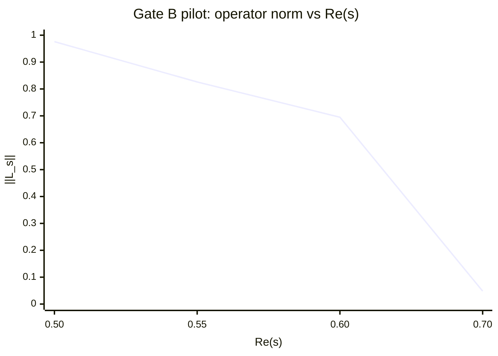
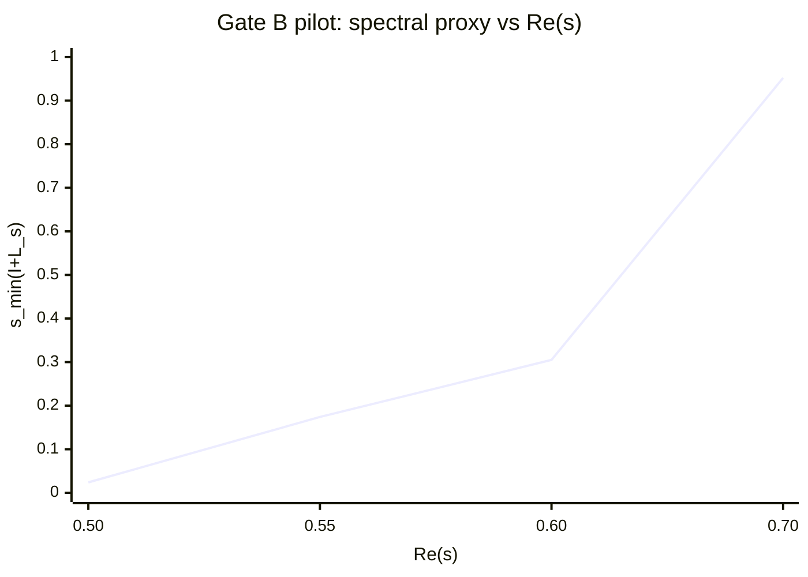
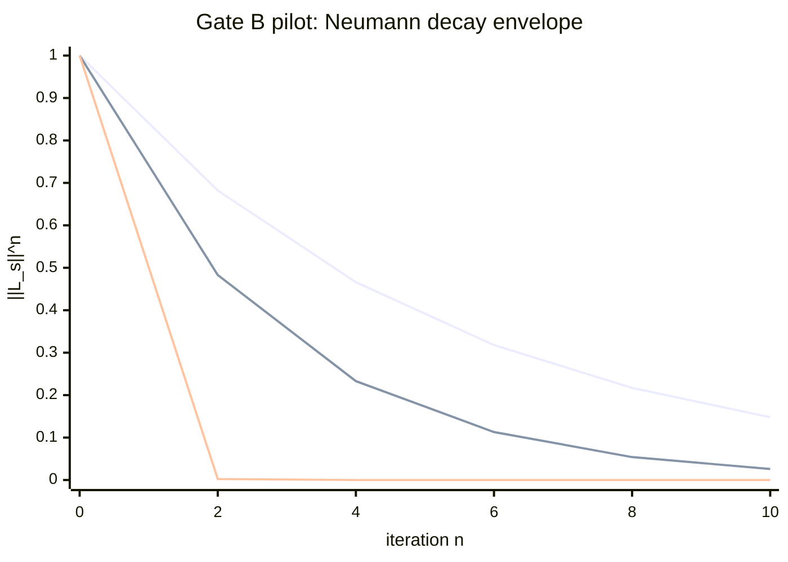
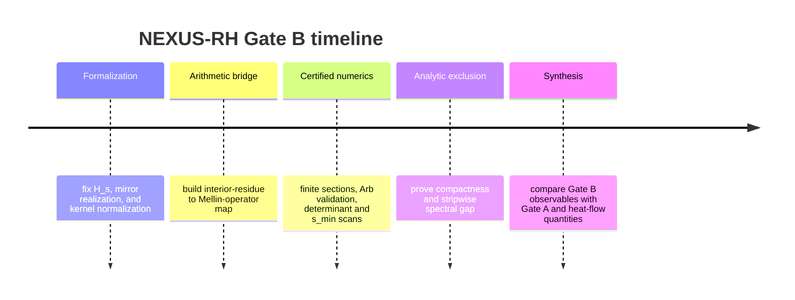

# NEXUS-RH as a Runtime-Safety Research Program

## Executive Summary

The uploaded NEXUS materials can be turned into a mathematically serious research program if they are interpreted not as a finished proof, but as a **two-gate operator program** for RH: Gate A is a static hyperbolicity check on Jensen polynomials, and Gate B is a dynamic **runtime-safety** problem for a doubled \(s\)-fiber/\((1-s)\)-fiber operator. In the internal notes, Gate B is already formulated around the targets \(\ker(I+\mathbb L_s)=\{0\}\) and, more strongly, \(\|\mathbb L_s\|<1\) for \(\Re(s)>\tfrac12\), with finite-model scans used to monitor norms, determinants, and smallest singular values. That is the right direction. It replaces loose metaphor with a concrete spectral exclusion problem. But the uploaded materials themselves still leave open the decisive steps: the exact Banach/Hilbert space, the proof that the arithmetic cascade is compact or determinant-class after renormalization, and the “shape-fit exclusion” argument that forbids \(-1\) from entering the spectrum off the critical line. fileciteturn0file8 fileciteturn0file10

There is a rigorous way to formalize this. The cleanest version uses a weighted Mellin-space Hilbert bundle
\[
\mathbb H_s = H_s \oplus H_{1-s},
\]
a renormalized arithmetic operator \(K_s^{\mathrm{ren}}\) induced by signed Buchstab/rough-number data, a mirror operator \(J_R(s)\) built from the zeta functional equation, and a closed-loop operator
\[
\mathbb L_s = \mathbb J_R(s)\,\mathbb K_s^{\mathrm{ren}}.
\]
If \(\mathbb L_s\) is trace class, then a Fredholm determinant \(\det(I+\mathbb L_s)\) exists; if it is only Hilbert–Schmidt, then the right object is the \(2\)-modified Fredholm determinant \(\det_2(I+\mathbb L_s)\), whose nonvanishing is still equivalent to invertibility. This part is standard operator theory, and it is the right shell for Gate B. citeturn36view0turn36view2

Gate A is also legitimate, but it should be used as a **consistency gate**, not as the main proof engine. Pólya’s criterion makes RH equivalent to hyperbolicity of associated Jensen polynomials; modern work proves hyperbolicity for all large shifts at each fixed degree, and for all cases up to degree \(8\), with later effective refinements for the \(\xi\)-function. At the same time, Farmer has made a strong case that Jensen-polynomial hyperbolicity, by itself, is unlikely to be the route that resolves RH. That makes Gate A valuable as a compile-time validation layer, but not a substitute for Gate B’s spectral exclusion. citeturn14search1turn16search0turn29view2

The de Bruijn–Newman connection is real and important, but it must be used carefully. In the classical literature, the heat parameter \(\lambda\) deforms the \(\Xi\)-kernel via the de Bruijn–Newman flow, Newman proved the existence of a critical constant \(\Lambda\), RH is equivalent to \(\Lambda\le 0\), Rodgers and Tao proved \(\Lambda\ge 0\), and Polymath improved the unconditional upper bound to \(\Lambda\le 0.22\). What the NEXUS framework can legitimately claim is that Gate B suggests a **contractive/off-seam safety observable** whose sign should correlate with the same seam condition. What it cannot yet claim is that any internal constant \(H\) is literally the de Bruijn–Newman parameter or that \(H=\pi/9\) is a theorem of the RH branch. In the uploaded NEXUS materials, that quantity is still background geometry, not established operator content. citeturn19search0turn34search1turn28view0turn17search0turn17search1

The strongest actionable program is therefore this: define the doubled operator rigorously; prove three bridge lemmas connecting interior residue data, the mirror, and the exclusion mechanism; compute robust finite sections on reproducible bases; and only then test optional “bridge constants” like \(H\) as emergent normalized observables rather than assumed truths. That is the shortest path from the current internal NEXUS state to a publishable research program. fileciteturn0file8

## Formalization and Targets

A workable mathematical model should start with a **weighted Mellin Hilbert space** that is symmetric under \(x\mapsto 1/x\) and mild enough to accommodate prime-density heuristics. A good default is
\[
\rho_{\eta,\pi}(u):=\frac{e^{-2\eta |u|}}{1+|u|},\qquad \eta>0,
\]
and for \(s=\sigma+it\),
\[
H_s:=L^2\!\left(\mathbb R_+,\;x^{2\sigma-1}\rho_{\eta,\pi}(\log x)\,\frac{dx}{x}\right).
\]
This is not canonical; it is a modeling choice designed to preserve the inversion symmetry and to provide exponential localization on log-scale. Via
\[
(U_sf)(u):=e^{(\sigma-\frac12)u}\rho_{\eta,\pi}(u)^{1/2}f(e^u),
\]
each \(H_s\) is unitarily equivalent to a weighted \(L^2(\mathbb R,du)\) space on log-coordinates, which is the natural setting for Buchstab-type threshold recursion. That log-space move is justified by the standard role of Mellin inversion in rough-number analysis and by the Buchstab function’s Laplace-transform formulation. citeturn37view0turn37view1

The arithmetic runtime should then be modeled as a **localized Mellin-convolution operator**. Let \(\mu^{\mathrm{ren}}\) be a renormalized signed measure on log-prime breaks, built from the least-prime-factor decomposition that underlies Buchstab’s identity,
\[
\Phi(x,y)=\Phi(x,z)+\sum_{y<p\le z}\sum_{v\ge 1}\Phi(x/p^v,p),
\]
or its single-break variant, after subtracting the explicit boundary/main-term contribution. On log-scale one can then define
\[
(\widetilde K_s^{\mathrm{ren}}F)(u)
=
q_\eta(u)\int_{\mathbb R}\kappa_s(u-v)\,q_\eta(v)F(v)\,dv
\;+\; r_s[F](u),
\]
where \(q_\eta(u)=e^{-\eta|u|}\), \(\kappa_s(t)=e^{-st}\,d\mu^{\mathrm{ren}}(t)\), and \(r_s\) is a finite-rank or trace-class counterterm that restores the correct normalization after boundary subtraction. Conjugating back gives
\[
K_s^{\mathrm{ren}}:=U_s^{-1}\widetilde K_s^{\mathrm{ren}}U_s:H_s\to H_s.
\]
If the conjugated kernel is square-integrable, then \(K_s^{\mathrm{ren}}\) is Hilbert–Schmidt and hence compact; if the kernel is sufficiently regular and decays exponentially away from the diagonal, then trace-class follows. Those are standard sufficient conditions for integral operators and are exactly the level of regularity Gate B needs. citeturn37view0turn36view0

The mirror must be formulated with both the **functional-equation scalar multiplier** and the **geometric inversion**. The zeta function satisfies the reflection formulas encoded by the standard multiplier
\[
\chi(s)=2^s\pi^{s-1}\sin\!\left(\frac{\pi s}{2}\right)\Gamma(1-s),
\]
and the uploaded NEXUS notes propose a completed scalar mirror factor of the form
\[
j_R(s)=\chi(s)^{-1}\frac{E_R(s)}{E_R(1-s)},
\qquad
E_R(s)=\prod_{p\mid R}(1-p^{-s})^{-1}.
\]
A rigorous operator realization compatible with the weighted bundle is
\[
(J_R(s)f)(x):=j_R(s)\,x^{1-2\sigma}f(1/x),
\qquad
J_R(s):H_{1-s}\to H_s.
\]
Then
\[
J_R(s)J_R(1-s)=I
\]
provided \(j_R(s)j_R(1-s)=1\), which is exactly the involution relation emphasized in the internal NEXUS materials. Moreover, because \(|\chi(\tfrac12+it)|=1\) on the critical line, this mirror is unitary on the seam and nonunitary off the seam, matching both the functional equation and the internal “unitary seam” intuition. citeturn26view0turn27view0 fileciteturn0file8

With these pieces, the natural doubled bundle is
\[
\mathbb H_s:=H_s\oplus H_{1-s},
\]
with block operators
\[
\mathbb K_s^{\mathrm{ren}}
:=
\begin{pmatrix}
K_s^{\mathrm{ren}}&0\\
0&K_{1-s}^{\mathrm{ren}}
\end{pmatrix},
\qquad
\mathbb J_R(s)
:=
\begin{pmatrix}
0&J_R(s)\\
J_R(1-s)&0
\end{pmatrix},
\]
and the Gate B closed loop
\[
\boxed{\mathbb L_s:=\mathbb J_R(s)\mathbb K_s^{\mathrm{ren}}.}
\]
The right proof targets are then exactly the ones the user asked to elevate:
\[
\boxed{\ker(I+\mathbb L_s)=\{0\}\quad\text{for }\Re(s)>\tfrac12}
\]
and the stronger quantitative target
\[
\boxed{\|\mathbb L_s\|<1\quad\text{for }\Re(s)>\tfrac12.}
\]
If \(\mathbb L_s\in \mathcal S_1\), define
\[
D_R(s):=\det(I+\mathbb L_s).
\]
If only \(\mathbb L_s\in\mathcal S_2\), define instead
\[
D_{R,2}(s):=\det_2(I+\mathbb L_s),
\]
whose nonvanishing is still equivalent to invertibility. The internal NEXUS hope that \(D_R(s)\) factors as \(C_R(s)\xi(s)\) should be treated as a **separate conjectural identity**, not as an assumption. citeturn36view0turn36view2 fileciteturn0file8

## Bridge Lemmas and Proof Strategies

The first bridge lemma should formalize how the **interior residue** becomes a compact arithmetic operator.

**Interior-residue transfer lemma.** Let \(I(x)\) denote the interior Hall residue after explicit boundary subtraction, and assume there is a renormalized signed log-break measure \(\mu^{\mathrm{ren}}\) such that for a class of smooth Mellin windows \(W\),
\[
\int_1^\infty I(x)W(x)x^{-s}\frac{dx}{x}
=
\int_{\mathbb R}\widehat W(t)\,d\mu^{\mathrm{ren}}_s(t)
+
B_W(s),
\]
where \(B_W(s)\) is explicit and trace-class at operator level. If \(\mu^{\mathrm{ren}}\) has exponentially weighted \(L^2\) density after smoothing, then the localized Mellin-convolution operator \(K_s^{\mathrm{ren}}\) is Hilbert–Schmidt on \(H_s\); if the density is also Lipschitz or \(W^{1,1}\) with exponential decay, then \(K_s^{\mathrm{ren}}\) is trace class. The proof strategy is to start from Buchstab’s identity and its log-threshold dynamics, pass to Mellin/Laplace coordinates, isolate the boundary term explicitly, and apply standard Schatten-class criteria after conjugation to an \(L^2\) kernel. citeturn37view0turn37view1turn36view0

The second bridge lemma should prove that the **two-fiber mirror is the correct return map** and reduce invertibility to one fiber by a Schur complement.

**Two-fiber mirror correctness lemma.** Assume \(J_R(s):H_{1-s}\to H_s\) is bounded and involutive, and that
\[
J_R(s)K_{1-s}^{\mathrm{ren}}J_R(1-s)=K_s^{\mathrm{ren}}+E_s
\]
with \(E_s\) trace class and analytic in \(s\) on \(\Re(s)>\tfrac12\). Then
\[
I+\mathbb L_s
=
\begin{pmatrix}
I & J_R(s)K_{1-s}^{\mathrm{ren}}\\
J_R(1-s)K_s^{\mathrm{ren}} & I
\end{pmatrix}
\]
is invertible if and only if the Schur complement
\[
S_s:=I-J_R(s)K_{1-s}^{\mathrm{ren}}J_R(1-s)K_s^{\mathrm{ren}}
\]
is invertible on \(H_s\). The proof is a standard block-operator computation once the mirror relation is in place. Conceptually, this is the formal version of the internal NEXUS insight that the “wrong mirror” traps Gate B in a fixed-\(s\) discretization, while the doubled bundle closes the loop correctly. fileciteturn0file8

The third bridge lemma is the decisive one: it should convert either contraction or stable finite-section geometry into a genuine **spectral prohibition**.

**Shape-fit exclusion lemma.** Let \(P_N\) be an increasing sequence of finite-rank projections on \(\mathbb H_s\) adapted to the chosen basis, with \(P_N\mathbb L_sP_N\to \mathbb L_s\) in trace norm (or Hilbert–Schmidt norm plus determinant-control hypotheses). Suppose that for each compact strip \(1/2+\varepsilon\le \Re(s)\le \sigma_0\), one has either

\[
\sup_{s}\|\mathbb L_s\| \le q_\varepsilon <1,
\]

or the weaker finite-section condition

\[
s_{\min}\!\bigl(I+P_N\mathbb L_sP_N\bigr)\ge \delta_\varepsilon>0
\quad
\text{for all }N\text{ large and all }s\text{ in the strip}.
\]

Then \(\ker(I+\mathbb L_s)=\{0\}\) on that strip, and the relevant Fredholm determinant does not vanish there. The direct proof in the first case is Neumann series. The second case uses convergence of finite-section determinants and lower-semicontinuity of singular-value gaps. If one also succeeds in encoding finite-section characteristic polynomials by stability-preserving symbols, then Borcea–Brändén theory gives an additional route to control zero-crossing events. citeturn36view2turn36view0turn35search6

These three lemmas are enough to reorganize the current NEXUS state into a real theorem pipeline. The arithmetic side is no longer “prove RH directly”; it becomes: define \(\mu^{\mathrm{ren}}\), prove \(K_s^{\mathrm{ren}}\) is determinant-class after localization, verify the mirror intertwining, and establish a uniform forbidden-zone estimate around \(-1\) in the spectrum. That is a realistic program.

## de Bruijn–Newman and Gate A/B Calibration

The de Bruijn–Newman side of the story is mathematically clear. De Bruijn introduced the heat-deformed transforms \(H_t\); Newman proved that there is a finite threshold \(\Lambda\) so that the zeros are all real exactly for \(t\ge \Lambda\); RH is equivalent to \(\Lambda\le 0\); Rodgers and Tao proved \(\Lambda\ge 0\); and Polymath later improved the unconditional upper bound to \(\Lambda\le 0.22\). In other words, the classical heat-flow program already identifies the critical line as a seam where “just enough” stability remains. That is why the NEXUS language of runtime safety and seam stability is not empty metaphor: it has a genuine analogue in the standard heat-flow literature. citeturn28view0turn34search1turn17search0turn17search1

Gate A belongs exactly on this seam. Pólya’s criterion relates RH to hyperbolicity of Jensen polynomials; Griffin, Ono, Rolen, and Zagier proved asymptotic hyperbolicity for each fixed degree and all sufficiently large shifts, as well as all cases through degree \(8\), and the later \(\xi\)-function work made parts of this effective. But Farmer’s critique matters here: these hyperbolicity phenomena are compelling and mathematically rich, yet they may reflect “differentiation universality” more than the fine geometry of zeta zeros themselves. So the right use of Gate A in a NEXUS research program is as a **static certification layer**: it should check whether any proposed Gate B normalization is compatible with known hyperbolicity behavior, but it should not be treated as an independent proof path. citeturn14search1turn16search0turn29view2

The right way to connect Gate B and de Bruijn–Newman is therefore **not** to assert an equality between an internal constant \(H\) and \(\Lambda\). Instead, one should introduce a **Gate-B heat family**
\[
\mathbb L_{s,\lambda}
:=
\mathbb J_R(s)\,\mathbb K_{s,\lambda}^{\mathrm{ren}},
\]
where \(\mathbb K_{s,\lambda}^{\mathrm{ren}}\) is obtained by applying a Gaussian heat weight to the log-frequency side of the arithmetic kernel, chosen so that its deformation is consistent with the standard \(\Xi\)-heat flow at the level of Mellin/Fourier variables. Then define dimensionless calibration observables such as
\[
R_1(\sigma;N,T):=\frac{1-\|\mathbb L_s^{(N,T)}\|}{\sigma-\frac12},
\qquad
R_2(\sigma;N,T):=\frac{s_{\min}(I+\mathbb L_s^{(N,T)})}{\sigma-\frac12},
\]
and
\[
R_3(\sigma;N,T):=
-\frac{\partial_\lambda \log \det_2(I+\mathbb L_{s,\lambda}^{(N,T)})|_{\lambda=0}}{\log T}.
\]
If any internal “equilibrium constant” exists, it should emerge as a common asymptotic limit of such normalized observables across basis choices, truncations, and \(t\)-windows. If it does not survive those tests, it should be discarded. That is the rigorous way to treat a candidate \(H\). citeturn28view0turn36view0

This also leads to the correct statement about the internal NEXUS candidate \(H=\pi/9\). It may be useful as an **organizing coordinate** in the broader NEXUS computational worldview, but on the RH branch it should currently be treated only as a **falsifiable normalization hypothesis**. The standard de Bruijn–Newman sources do not define such a constant, and the uploaded NEXUS materials themselves do not yet promote it to established operator content. So the correct research stance is: do not force \(H=\pi/9\) into the proof; test whether a stable, basis-independent Gate-B normalization converges near it. If yes, that becomes evidence. If not, drop it. citeturn28view0turn17search1

## Numerical Program and Reproducibility

A serious Gate B program needs four data streams: rough-number/Buchstab data, zeta/functional-equation data, determinant/singular-value numerics, and reproducibility infrastructure. The best current public numerical source for zeta zeros is the LMFDB/Platt pipeline: the database stores the first \(103{,}800{,}788{,}359\) zeros on the critical line, with imaginary parts recorded to absolute precision \(\pm2^{-102}\), and completeness verified by a rigorous form of Turing’s method; LMFDB also documents an independent comparison against Büthe’s list. For rigorous local zero generation and verification, Arb exposes routines derived from Platt’s method. For flexible prototyping of \(\zeta\), \(\xi\), and \(\chi\), mpmath is a suitable floating-point frontend; for actual certification, Arb or interval/ball arithmetic should be the default. citeturn11search2turn24view0turn24view1turn12search11turn12search13turn12search0

The most useful parameter table for Phase I is the following.

| Component | Default choice | Sensitivity choices | Why this is the right default |
|---|---|---|---|
| Function space | \(H_s=L^2(\mathbb R_+,x^{2\sigma-1}\rho_{\eta,\pi}(\log x)\,dx/x)\) with \(\eta=0.5\) | \(\eta\in\{0.25,0.75,1.0\}\); unweighted Mellin \(dx/x\) | Symmetric under \(x\mapsto 1/x\), localized on log-scale, prime-density-like |
| Basis | Log-Laguerre functions | Log-wavelets; truncated Mellin-Fourier basis; Nyström quadrature basis | Laguerre bases are stable for exponentially weighted half-line kernels |
| Arithmetic truncation | \(x_{\max}=10^6\) prototype | \(10^8\), \(10^{10}\) with HPC | Matches the user’s requested default and is enough to stabilize pilot kernels |
| Finite-section size | \(N_{\mathrm{basis}}=256\) prototype | \(512,1024,2048,4096\) | Enough to see convergence trends before expensive sweeps |
| \(s\)-grid | \(\sigma\in\{0.70,0.65,0.60,0.58,0.56,0.54,0.52,0.51\}\) | finer seam grid down to \(0.5005\) | Concentrates effort where contraction is hardest |
| \(t\)-grid | \(t\in\{0,\gamma_1,10^2,10^3,10^4\}\) plus local zero windows | random windows at larger heights | Samples both low-lying structure and asymptotic regimes |
| Determinant regime | \(\det_2\) by default | full \(\det\) when trace-class proven | Safe under Hilbert–Schmidt hypotheses |
| Numerical tolerance | \(10^{-12}\) floating; \(10^{-30}\) Arb checks on critical runs | tighter on seam-adjacent points | Consistent with mixed prototype/certified workflow |

The core algorithm can then be divided exactly as the user requested.

For the arithmetic side, compute rough-number counts and interior residues using a segmented sieve plus Buchstab recursion. Fan’s recent treatment is a good practical source for explicit rough-number formulas and for the modern presentation of Buchstab’s identity; Lagarias gives the transform side of the Buchstab function. This stage outputs either a smoothed log-break measure \(\mu^{\mathrm{ren}}\) or a matrix of basis coefficients directly. citeturn37view0turn37view1

For the mirror, compute \(j_R(s)\) from the functional-equation side using
\[
\chi(s)=2^s\pi^{s-1}\sin(\pi s/2)\Gamma(1-s)
\]
and, if desired, the finite Euler dressing \(E_R(s)\) from the internal NEXUS proposal. Then build the geometric inversion matrix induced by \(f(x)\mapsto x^{1-2\sigma}f(1/x)\). This produces the block operator \(\mathbb J_R(s)\) on the doubled basis. citeturn26view0turn27view0

For the spectral stage, compute the following load-bearing quantities on each finite section:
\[
\|\mathbb L_s^{(N)}\|,\qquad
s_{\min}(I+\mathbb L_s^{(N)}),\qquad
\det_2(I+\mathbb L_s^{(N)}),
\]
and the eigenvalue cloud of \(\mathbb L_s^{(N)}\). Bornemann’s Nyström framework and later matrix-valued extensions by Gallo, Zweck, and Latushkin provide the right numerical determinant machinery. The smallest singular value is especially important because it is a direct numerical proxy for the forbidden event \(-1\in \sigma(\mathbb L_s)\). citeturn36view2turn36view0

For the Mellin bridge, compute smoothed transforms
\[
\widehat I_W(s)=\int_1^{x_{\max}} I(x)W(x/X)x^{-s}\frac{dx}{x}
\]
over a family of windows \(W\), and fit these against the matrix elements of \(K_s^{\mathrm{ren}}\). This is what turns “interior reusable pressure” into a reproducible operator coefficient stream instead of a metaphor.

A reproducible prototype can be written in a direct, testable way:

```python
# pseudocode only

def prime_data(xmax):
    # segmented sieve, prime table, least-prime-factor table
    return primes, lpf

def rough_counts(x_grid, y_grid, lpf):
    # compute Phi(x, y) and signed residue channels
    return Phi, interior_residue, boundary_residue

def build_mu_ren(interior_residue, smoothing_kernel, x_grid):
    # convert residue data into renormalized log-break measure
    return mu_ren

def laguerre_basis(nbasis, eta):
    # log-Laguerre basis functions on R_+
    return basis

def assemble_K(s, basis, mu_ren, eta):
    # build K_s^{ren} matrix by localized Mellin convolution
    return K

def chi(s):
    return 2**s * pi**(s-1) * sin(pi*s/2) * gamma(1-s)

def euler_dressing(s, R_primes):
    out = 1
    for p in R_primes:
        out *= (1 - p**(-s))**(-1)
    return out

def assemble_JR(s, basis, R_primes):
    jr_scalar = chi(s)**(-1) * euler_dressing(s, R_primes) / euler_dressing(1-s, R_primes)
    # combine scalar with inversion matrix f(x) -> x^(1-2sigma) f(1/x)
    return JR

def assemble_bundle(Ks, K1s, JR_s, JR_1s):
    K_bundle = block_diag(Ks, K1s)
    J_bundle = [[0, JR_s], [JR_1s, 0]]
    return J_bundle @ K_bundle

def diagnostics(L):
    normL = spectral_norm(L)
    smin = smallest_singular_value(np.eye(L.shape[0]) + L)
    evals = eigenvalues(L)
    det2 = modified_fredholm_det_2(L)
    return normL, smin, evals, det2
```

The uploaded internal NEXUS scans already suggest the right diagnostics. One finite-model witness reports \(\|\mathbb L_s\|\) dropping from about \(0.976\) at \(\sigma=0.50\) to about \(0.048\) at \(\sigma=0.70\), while \(s_{\min}(I+\mathbb L_s)\) rises from about \(0.024\) to about \(0.952\). Those are exactly the observables that a real Gate B notebook should track, but they are only finite-model witnesses and should be treated as **model-dependent pilot data**, not as theorem-level quantities. fileciteturn0file8

The pilot charts below are therefore best read as **specifications for the research notebook**; the first two use the uploaded finite-model witness, and the third shows the corresponding Neumann decay envelope that would follow if those norms were stable under refinement. The third plot uses the series order \(\sigma=0.55, 0.60, 0.70\).







And the computational pipeline itself is straightforward:

```mermaid
flowchart LR
    A[Prime data and LPF tables] --> B[Rough counts Phi(x,y)]
    B --> C[Interior residue I(x)]
    C --> D[Mellin and log-threshold transforms]
    D --> E[Build K_s^ren and K_1-s^ren]
    E --> F[Build J_R(s) from chi(s) and optional E_R(s)]
    F --> G[Assemble doubled bundle L_s]
    G --> H[Spectra, s_min, det_2, Neumann decay]
    H --> I[Strip-by-strip contraction test]
    I --> J[Gate A consistency check via Jensen hyperbolicity]
```

A realistic task schedule is also clear:



## Deliverables, Sources, and Open Questions

The right deliverables are not abstract promises; they are concrete, checkable objects.

| Deliverable | What it must contain | Acceptance criterion |
|---|---|---|
| Formal note on spaces and operators | precise \(H_s\), \(K_s^{\mathrm{ren}}\), \(J_R(s)\), \(\mathbb L_s\) | all domains/ranges and class assumptions explicit |
| Bridge-lemma manuscript | the three lemmas above with hypotheses | every open assumption isolated and testable |
| Reproducible numerical notebook | code, configs, seeds, basis choices, raw outputs | same plots regenerate on fresh machine |
| Certified seam scan | Arb-backed \(s_{\min}\), \(\det_2\), and eigenvalue gap data | independent rerun within tolerances |
| Gate A/B comparison note | Jensen data versus operator diagnostics | no hidden normalization changes |

The prioritized bibliography should remain anchored to primary sources. For the heat-flow side: de Bruijn’s 1950 paper, Newman’s 1976 paper, Rodgers–Tao on \(\Lambda\ge 0\), and the Polymath upper-bound paper are essential. For Gate A: Pólya’s criterion as used in Griffin–Ono–Rolen–Zagier, the later \(\xi\)-function paper, and Farmer’s critique. For Buchstab and rough numbers: modern explicit sources like Fan together with Lagarias’s transform treatment. For Gate B numerics: Bornemann and the recent matrix-valued Fredholm-determinant analysis by Gallo–Zweck–Latushkin. For operator-theoretic antecedents to RH: Connes, Burnol, and Deninger are the right historical comparators. For data and software: LMFDB/Platt, Arb, and mpmath. citeturn19search0turn34search1turn28view0turn17search0turn14search1turn16search0turn29view2turn37view0turn37view1turn36view2turn36view0turn32view0turn31view0turn31view1turn33search1turn24view0turn24view1turn12search11turn12search13turn12search0

The main limitations are short and important. The internal NEXUS materials already contain the **right structural question**, but not yet the decisive theorem. The determinant–zeta identity is still conjectural. The compactness or trace-class status of the renormalized Buchstab operator depends on a localization/regularization choice that must be fixed once and for all. The finite Gate B scans are promising but normalization-sensitive across uploaded notes, which means they are currently evidence of a **pattern**, not of a stable invariant. And any claim tying \(H=\pi/9\) directly to the de Bruijn–Newman flow, the \(\Xi\)-kernel, or the RH operator must be treated as unproved until it survives the stripwise, basis-independent calibration tests described above. Those are not fatal weaknesses. They are exactly the open questions that define the next rigorous phase of the NEXUS-RH program.